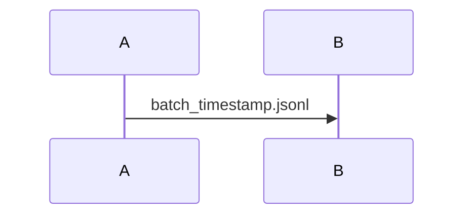

---
paths:
  - "**/*.md"
---

# Mermaid Diagram Conventions

## Node labels with line breaks

Use `<br/>` for line breaks inside node labels. The literal `\n` is **not** interpreted by Mermaid and leaks into the rendered output as visible text.

Any node label that contains `<br/>`, special characters, or HTML must be wrapped in double quotes.

```mermaid
%% Bad — \n leaks as literal text
A[First line\nSecond line]

%% Good — <br/> with quotes
A["First line<br/>Second line"]
```

## Curly braces in labels

Curly braces `{}` are reserved syntax in Mermaid (rhombus/decision nodes). Never use them inside `[...]` labels — the parser will throw `DIAMOND_START` errors.

```mermaid
%% Bad — parser chokes on {ts}
OUT[batch_{ts}.jsonl]

%% Good — spell it out or use quotes
OUT["batch_timestamp.jsonl"]
```

## Forward slashes in labels

A forward slash `/` at the start of a `[...]` label triggers Mermaid's asymmetric shape syntax. Always quote labels that contain slashes.

```mermaid
%% Bad — /research is parsed as shape syntax
SKILL[/research skill]

%% Good — quoted
SKILL["/research skill"]
```

## General quoting rule

When in doubt, wrap the label in double quotes. Quoted labels accept any content safely. Only plain alphanumeric labels (no special chars, no `<br/>`) can go unquoted.

```mermaid
%% Safe — plain text, no special chars
A[Simple label]

%% Needs quotes — contains <br/>, special chars, or punctuation
B["Label with<br/>line break"]
C["data/raw/output.jsonl"]
D["localhost:11235"]
```

## Sequence diagram messages

In `sequenceDiagram`, message text is plain (not inside `[...]`), so `<br/>` and quotes are unnecessary. But curly braces still cause issues — avoid them in message labels too.


