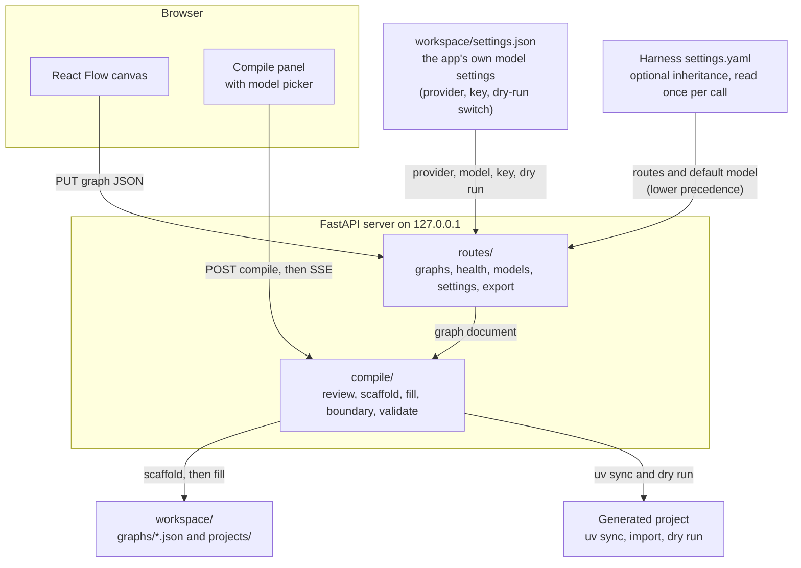
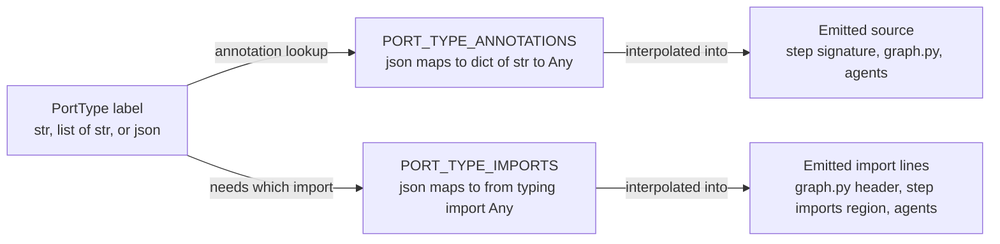

# Swarm Builder — architecture

How the pieces fit. This is the contributor-facing companion to
[`guide.md`](./guide.md) (user-facing) and
[`api.md`](./api.md) (the HTTP contract). [`../PLAN.md`](../PLAN.md) is the
design record — the probe facts, the rejected alternatives, and the
reasoning behind every decision here. This file explains the *shape of the
system as built*, and points at the code that owns each piece.

- [The one-sentence version](#the-one-sentence-version)
- [The graph document](#the-graph-document)
- [The frontend's compile types are derived, not invented](#the-frontends-compile-types-are-derived-not-invented)
- [The five compile phases](#the-five-compile-phases)
- [Marker regions and the two-tier boundary check](#marker-regions-and-the-two-tier-boundary-check)
- [The deps_type seam](#the-deps_type-seam)
- [Model-route inheritance and the two emission paths](#model-route-inheritance-and-the-two-emission-paths)
- [Why the harness SDK tie-in was dropped](#why-the-harness-sdk-tie-in-was-dropped)
- [Running a workflow and generating a graph](#running-a-workflow-and-generating-a-graph)
- [Build the docs against the code](#build-the-docs-against-the-code)

## The one-sentence version

A React canvas edits a JSON graph document; a Python server validates that
document against a schema it owns, emits a complete `pydantic-graph` project
from templates plus one in-process model call, and then proves the result
imports and runs **with no credentials at all**.



Model resolution has one precedence chain, in one place
(`inherit/settings.resolve_effective_model`): **graph override → the app's own
settings (`app-config`) → an inherited `settings.yaml` default → `SWARM_MODEL`
→ the built-in offline stand-in**. Whichever source wins supplies the whole
selection — provider, model, endpoint and key together — because a pair no
single source declares (a provider from one, a model id from another) is exactly
the silent mis-routing that chain exists to make impossible. The optional
inherited file therefore keeps working, and is simply no longer the first thing
a new user is asked for.

Two structural properties are worth stating up front, because most of the
design follows from them:

1. **Compilation is template-first.** The server emits every structural file
   itself — including all graph wiring — and asks the model only for the
   marked body regions of `steps/<id>.py`. Token use stays low, failures stay
   local, and a model mistake cannot corrupt graph structure.
2. **There is no subprocess boundary around the agent, and no harness
   dependency.** The fill agent runs in the server process, calls the model
   provider directly, and spawns no child process at all: its self-check tool
   parses in-process instead of executing
   ([why](#the-agent-cannot-execute-code-and-that-is-the-invariant)). The only
   harness contact is *optionally reading* its settings file. The validation
   gate is the one place that does shell out, and it shells out to `uv` on the
   generated project, never to model-authored code.

**Where a credential lives.** The API key a user enters in the app is written
to `workspace/settings.json` with `0600` permissions (inside the git-ignored
workspace), and published into the server process's environment under the
provider's own variable name (`OPENAI_API_KEY`, …) — which is what makes
PydanticAI's known-name resolution, the credential check, and every run
subprocess agree without a second place that knows how to build a model. It is
never returned by any endpoint (only "a key is stored" plus its last four
characters), never logged, and never written into a generated project; the
gate that proves a project imports and dry-runs keylessly has every publishable
variable in its strip list, asserted by a test.

## The graph document

`src/swarm_builder/models.py` is the single source of truth for the canvas's
save format. It is pydantic models with `extra="forbid"`, validated on every
read and write, and the frontend's TypeScript types are generated from this
server's own OpenAPI document rather than hand-maintained
(`scripts/generate_web_types.py`) — "one schema, two consumers", which is
what removes the drift a hand-written TypeScript mirror would guarantee.

**The camelCase-on-the-wire convention**, and the inconsistency it resolves.
The project's prose mixes both spellings (`entryNodeId` and
`entry_node_id` appear in the same paragraph in `PLAN.md`). One rule settles
it, applied everywhere through `SwarmBaseModel`:

- **Python-side field names are snake_case** — idiomatic Python, and what
  every constructor call and attribute access in the codebase uses.
- **JSON aliases are camelCase**, generated by `alias_generator=to_camel`
  (`entry_node_id` ↔ `entryNodeId`) — because documents round-trip through
  JSON files on disk, and the generated TypeScript must read naturally as
  JavaScript.
- **`populate_by_name=True`** means both spellings are accepted on input:
  constructing a model in Python uses the snake_case name, parsing JSON from
  a file or an HTTP body uses the camelCase alias. Serialization always emits
  the alias.

**Two authoritative lookup tables live in `models.py`**, not in the emitter
or the validator, because both need exactly the same mapping and a second
copy would drift:

| Table | Purpose |
|---|---|
| `PORT_TYPE_ANNOTATIONS` / `PORT_TYPE_IMPORTS` | `str` → `str`; `list[str]` → `list[str]`; `json` → `dict[str, Any]` plus `from typing import Any`. A `PortType` is **never** interpolated verbatim into generated source: the label `json` is not a valid annotation, so emitting it produces a module that raises `NameError`. This is also the only place `Any` is permitted in this codebase. |
| `REDUCER_FUNCTIONS` | Exactly four `ReducerId` literals → `reduce_list_append`, `reduce_list_extend`, `reduce_dict_update`, `reduce_sum`. `reduce_null` exists upstream but deliberately has no counterpart; joining without a reducer is expressed by omitting the join spec. |

**A `json` port has to survive three separate hops, and each one asks the right
table rather than inspecting rendered text.** Both hops below shipped broken
once, which is why the `json_ports` codegen fixture exists.



1. **`graph.py`'s header.** `graph.py` evaluates `input_type=`/`output_type=`
   and `Literal[...]` at **runtime** (`from __future__ import annotations` only
   defers annotations, never these expressions), so a `json` port there needs a
   real `from typing import Any`. The emitter asks
   `PORT_TYPE_IMPORTS[port_type] == "from typing import Any"`. It used to test
   the rendered annotation instead — a membership test against strings like
   `"dict[str, Any]"` can never match a bare `"Any"` — so the import was
   silently dropped and the module raised `NameError: name 'Any' is not
   defined` at import time.
2. **The step signature and its imports region.** `scaffold.py` renders the
   annotation from `PORT_TYPE_ANNOTATIONS` and seeds the `imports` region from
   `PORT_TYPE_IMPORTS`, so both the annotation and the import it needs come from
   tables rather than from the label.
3. **The agent factory's `output_type`.** `scaffold.py:_render_agent_factory`
   substitutes `$output_annotation` and `$output_type_import` into each
   `templates/<id>/agent.py.tmpl`, so `build_agent` returns
   `Agent[None, <annotation>]` and constructs `Agent(output_type=<annotation>,
   ...)`. All three templates previously hardcoded `Agent[None, str]`, so a
   `json`-output agent node returned a `str` and failed Phase 5's output-type
   assertion. A hardcoded `str` here and a table-driven annotation everywhere
   else is exactly the kind of drift the "one schema, two consumers" rule
   exists to prevent — so the factory takes the node's declared output port
   type, not a constant.

**The edge model is a discriminated union, not a `{source, target}` pair.**
`add_edge` alone cannot express branching (that needs a match expression on a
`Decision`), cannot express fan-in (that needs a `Join` with a reducer), and
turns two successors into a *silently lossy* fan-out: `a → left`, `a →
right`, both → end builds and runs both steps, but the graph's output is one
arbitrary branch. So `SwarmEdge` is `SeqEdge | BranchEdge | FanoutEdge |
JoinEdge | DelegateEdge`, discriminated on `kind`.

The exact wire shape, every literal, and every per-kind spec object are in
[`api.md`'s appendix](./api.md#appendix-the-graph-document).

### Control flow that v1 supports, and what it rejects

`seq`, `branch` (via `decision` nodes), and `fanout` + `join` are supported.
**Cycles are rejected outright** in Phase 1 — and this is not conservatism.
`pydantic_graph`'s `GraphBuilder.build(validate_graph_structure=True)` is
**not** a cycle or orphan backstop: `add_edge(work, work)` builds *and runs*,
and a decorated-but-unedged step is silently dropped from both `graph.nodes`
and `render()`. What `build()` does check is that edges exist from start,
some edge reaches end, there are no non-`End` dead ends, end is reachable
from start, and all *referenced* nodes are reachable. Everything else —
cycles, orphans, lossy fan-out, branchless decisions, port-type mismatches,
state ownership — is Swarm Builder's own Phase-1 validator or nobody's.

Two consequences that are easy to get wrong:

- **Data does not pass through a `decision` node.** A branch target receives,
  via `ctx.inputs`, the *match value returned by the decision's source step* —
  not the payload that flowed into that source step. So a branch target's
  declared `io.inputType` must equal the **decision's source step's**
  `outputType`, never anything further upstream, and a workflow that needs
  the pre-classification payload inside a branch target must carry it through
  `State` explicitly. `DecisionSpec` documents this in its docstring so the
  Inspector can surface it; Phase 1 enforces the type rule.
- **Plain multi-successor fan-out is lossy, so it is a hard error.** Real
  fan-in goes through an explicit `builder.join(<reducer>,
  initial_factory=...)`, and Phase 1 refuses a multi-successor node whose
  successors are not `fanout` edges converging on a declared join.
  `build()` also injects a synthetic `<source>_broadcast_fork` node, so
  `graph.nodes` keys are *not* exactly the canvas node set — Phase 1 and
  Phase 5 both **compute** the expected key set from the document (canvas
  slugs + `__start__`/`__end__` + one predicted fork per fan-out source) and
  assert equality, rather than discovering whatever `build()` produced.

### The frontend's compile types are derived, not invented

The graph document is not the only thing generated from the server's schema.
Compile types are too, and the earlier hand-written mirror is gone:

| Layer | File | Role |
|---|---|---|
| Generated schema | `web/src/api/schema.ts` → `web/src/types.ts` | The one place that reaches into `components["schemas"][...]`, producing named aliases (`CompileSnapshot`, `FindingOut`, `ResolvedDefaultOut`, `CompileJobStatus`, …). Regenerated by `scripts/generate_web_types.py`. |
| SSE vocabulary | `web/src/api/compileWire.ts` | The part OpenAPI **cannot** express: the five event names, the five phase slugs, the three phase statuses, the `done`/`result` body, and the one narrowing function per frame shape. |
| UI state | `web/src/state/compileState.ts` | Pure functions over the compile sub-state: fold one frame, apply a snapshot, merge a patch, derive phase rows. |

Three conventions follow, and each fixed a real class of bug:

- **A streamed payload is narrowed exactly once.** `compileWire.ts`'s readers
  are the only code that looks at an untyped `data` blob, and every caller
  downstream gets a typed value. Rendering a raw payload with `String(x)` is
  what turned the whole streamed log into `[object Object]`; a `log` frame now
  shows its real `message`, and a finding riding a `log` frame keeps its `code`
  and `nodeIds`.
- **Phase statuses are the server's three values** (`started` / `succeeded` /
  `failed`), lifted from `compile/pipeline.py`'s constants, and a *job* status
  (`queued`/`running`/`succeeded`/`failed`/`cancelled`) is a distinct five-value
  vocabulary that is never conflated with it. A repeated
  `phase(fill, started)` is rendered as one row with a **retry** attempt count —
  which is what the server's second `started` means.
- **A snapshot never blanks the phase list, the log or the warnings.** The
  snapshot does not carry them, so `applyCompileSnapshot` applies only the
  fields it really has (`status`, `latestEventId`, `result`, `error`) and
  leaves those three alone; the resubscribed stream refills them. The patch
  merge is spelled out field by field rather than spread, so an explicit
  `{ logLines: undefined }` cannot replace an array with `undefined` — which is
  precisely how a mid-compile reload used to turn the next
  `[...logLines, line]` into a crash.

## The five compile phases

`src/swarm_builder/compile/pipeline.py` owns phase order, the retry policy,
job lifecycle transitions, and the SSE payload shapes. It owns no generation
logic: phases 1, 2, 4 and 5 are separate deterministic modules, and phase 3
is a narrow injectable seam.

| # | Phase | Deterministic? | Module | What it does |
|---|---|---|---|---|
| 1 | `review` | **yes** | `compile/review.py` + `inherit/` | Static validation of the document, then route resolution. Any error refuses the compile **before anything is written to disk**. |
| 2 | `scaffold` | **yes** | `compile/scaffold.py` + `emit_graph.py` | Emit the complete project, then immediately capture the Phase-4 boundary baseline — before any fill, so the baseline describes Phase 2's own output. |
| 3 | `fill` | **no — the only model call** | `compile/agent.py` (real) or `compile/fake_fill.py` (`SWARM_FAKE_FILL=1`) | Write the marked body regions of `steps/<id>.py`, with `read_file`/`write_region`/`parse_check` and no code execution. |
| 4 | `boundary` | **yes** | `compile/boundary.py` | Verify the fill touched nothing it was not allowed to touch. |
| 5 | `validate` | **yes** | `compile/validate.py` | `uv sync`, keyless import, and the generated project's own dry run. |

**Route resolution belongs to Phase 1.** An unmappable route is refused
there, with the route named and *before any scaffolding*, in the same
"refuse before writing" decision the review errors carry. Verified: a compile
that fails on an unmappable route leaves no project directory at all.

**Retry policy.** Phase 3 is retried **at most once**, and only when phase 4
or phase 5 fails — with the failure text handed to the retry as
`previous_failure`. A second failure is reported, not retried, so a
permanently failing fill produces exactly two fill attempts. A fill failure
itself (including the fill timeout) aborts immediately; it is not one of the
two conditions the policy names.

The retry only works because Phase 4's walk ignores what Phase 5 writes: a
retry re-runs phases 3 → 4 → 5 against the Phase-2 baseline, so the `uv.lock`
that the *first* attempt's `uv sync` left behind would otherwise be reported as
an `unexpected_new_file` and mask the dry-run failure that triggered the retry.
See [the boundary-check section](#why-two-tiers) for the exclusion and the bug
it fixed.

**Cancellation** is cancelling the job's `asyncio.Task` — the whole
mechanism, because there is no subprocess to kill. No phase catches
`CancelledError`: cancellation is deliberately not an error path.

**A failed compile leaves the project on disk** for inspection. On success
the `done` event carries the project path, the run command, the golden
diagram, the filled node ids, the attempt count, and the resolved model with
its source.

**`SWARM_FAKE_FILL=1`** swaps Phase 3 for `compile/fake_fill.py`, which
derives type-correct stub bodies from each node's declared output port type —
not from a fixture lookup table, so it works for an arbitrary user graph. Two
properties make it a real stand-in rather than a toy: it writes through the
same marker-region splice the real agent's `write_region` tool uses, so Phase
4 is exercised for real; and its bodies are type-correct, so a fake-fill
compile genuinely passes Phase 5's keyless gate. It skips any kind not in
`FILLABLE_NODE_KINDS` and any node with no `steps/<id>.py`, and a run with
nothing to write is a success rather than a `FillError` — which is what lets an
all-agent graph compile offline.

**The real filler is injected at the one place that can inject it.**
`routes/compile.py`'s `_run_job` resolves `_load_filler()` →
`swarm_builder.compile.agent.fill` and passes it as `filler=` to
`run_compile`, so a compile started over HTTP really does call a model. Both
imports are lazy (`_load_run_compile`/`_load_filler`) for the degradation
reason in that module's docstring: `compile/agent.py` imports `pydantic_ai`, so
a missing provider extra must fail the compile endpoints rather than server
startup. `run_compile` itself ignores the injected filler when
`SWARM_FAKE_FILL=1`, which is what keeps the offline path working.

## Marker regions and the two-tier boundary check

Phase 3 legitimately rewrites files, so a whole-file hash cannot cover them.
The resolution is a marker contract plus a **two-tier** check.

### The marker contract

Defined once, as functions rather than inline template literals, in
`compile/__init__.py`:

```python
# --- swarm:imports <nodeId> ---
...
# --- swarm:end-imports <nodeId> ---

async def step(ctx: StepContext[State, Deps, str]) -> str:
    # --- swarm:begin <nodeId> ---
    ...
    # --- swarm:end <nodeId> ---
```

The **imports region exists because a body needing `import httpx` has nowhere
else to put it**: the module's own import block is written by the scaffolder,
and an import placed inside the body markers would be visible to the model
but not to the module's header. Body markers are emitted indented one level
inside the function, so a parser must match them **ignoring leading
whitespace**. There are exactly two editable regions: `imports` and `body`.

The fill agent's `write_region(name, node_id, region, body)` is **the only
mutator anywhere in the pipeline**. That is what makes Phase 4 cheap: the
agent has no general-purpose file write, no shell, and no network, so every
byte outside the two regions is *provably* untouched — and Phase 4
independently re-verifies it anyway, because it also catches a template or
emitter bug, not just a tool bug.

### Why two tiers

| Tier | Files | Check |
|---|---|---|
| Forbidden | Everything scaffolded that is *not* a marker-bearing `steps/*.py` or `agents/*.py` — including `graph.py`, `state.py`, `deps.py`, `pyproject.toml`, and all of `validate/` | Whole-file **SHA-256** against the baseline captured at the end of Phase 2. Any change fails the compile, naming the path. |
| Permitted | `steps/*.py`, `agents/*.py` | Parsed into regions: every marker must still exist, the body region must be non-empty, and the **concatenation of everything outside both regions** is hashed and compared. This is what stops an edit *around* the sandbox. |

A third finding covers any file present that was not in the baseline:
`unexpected_new_file`. `__pycache__`, `.pyc`/`.pyo`, `.venv`, `.git` **and
`uv.lock`** are excluded, since they are produced by *running* Python (or `uv`)
against the project rather than by scaffolding it. The list lives in
`compile/boundary.py` as `_EXCLUDED_DIR_NAMES`, `_EXCLUDED_FILE_SUFFIXES` and
`_EXCLUDED_FILE_NAMES`, and `_iter_project_files` is the single place that
applies them — so adding an exclusion is a one-line change in one tuple.

> **Why `uv.lock` is in that list, and why omitting it was a real bug.** Phase
> 5 runs `uv sync`, which writes a lockfile into the project directory. The fill
> retry re-runs phases 3 → 4 → 5 against the baseline captured at the end of
> Phase 2, so on the second pass the lockfile Phase 5 had *just* written
> registered as `unexpected_new_file` and the compile failed in Phase 4 —
> reporting a boundary violation naming a file the model never touched, instead
> of the dry-run failure that triggered the retry. Every phase-5-failure retry,
> which is the one case the retry policy exists for, ended that way; the retry
> was structurally dead. `_EXCLUDED_FILE_NAMES` in `compile/boundary.py` now
> carries `{"uv.lock"}` next to the excluded directories, and the exclusion is
> narrow: a genuinely unexpected file is still caught.

Violation codes, for reading a failure: `missing_scaffolded_file`,
`forbidden_file_changed`, `missing_marker`, `empty_body_region`,
`outside_marker_text_changed`, `unexpected_new_file`. All are reported at
once — `check_boundary` never stops at the first — so nobody can react to a
partially-broken project.

### The two-layer confinement around it

`compile/confine.py` is the security-relevant invariant of v1, and it is
small: `Path.resolve()` then `is_relative_to(root.resolve())`, raising
`PathEscapesRootError` **before any I/O**. Resolving rather than counting
`..` segments is what catches a symlink planted inside the root whose target
escapes it. Every tool path in `agent.py` goes through it; the confinement is
enforced in the tool, never merely requested in the prompt.

### The agent cannot execute code, and that is the invariant

The fill agent has exactly three tools, and the important thing about them is
what is *absent*: no general-purpose file write, no shell, no network, and
**no way to run model-authored Python at all**.

| Tool | Does |
|---|---|
| `read_file(name)` | Reads one file inside the project. |
| `write_region(name, node_id, region, body)` | The **only** mutator anywhere in the pipeline. Replaces one marker region of one `steps/<id>.py`. |
| `parse_check(names?)` | Reads the step modules through the same confinement guard and runs `ast.parse` **in this process**. Executes nothing. |

`parse_check` is where the invariant is decided, and it is narrow on purpose.
What it replaced — `run_check(code)`, which ran arbitrary model-authored
snippets in a subprocess — was verified writing a file **outside** the project
directory. Phase 4 only walks the project directory, so a write out there is
invisible to the boundary check: the tool silently defeated the confinement
guard that every other path in the module carefully enforces. Since the only
verification the prompt ever asked the agent to perform was `ast.parse` over
the modules it had just written, narrowing the tool to exactly that loses no
real capability and makes "the agent's filesystem reach is the project
directory" true **by construction** rather than by prompt instruction. This is
`PLAN.md` assumption 9, and it holds only because of the narrowing; the full
record is the "Amendment (implementation)" note under Phase 3 in `PLAN.md`.

Consequences worth knowing before changing this module:

- **The agent spawns no subprocess, so `compile/agent.py` imports no
  `subprocess`, `os` or `signal`.** A change that reintroduces one of those
  imports, or a tool that runs code, silently reopens the hole. The suite's
  `test_agent.py` covers the tool set and the guard.
- **A parse error is data, not an exception.** `parse_check` returns a
  `CheckOutcome` whose `exit_code` is `1` with the offending file, line and
  message on `stderr`, so the agent can read its own mistake and fix the body.
  Phase 5 remains what actually executes the built graph; `parse_check` is just
  a much cheaper place to catch a syntax error than a `uv sync` is.
- **There is no `.venv` for it to use, which is why it is in-process.** The plan
  asked for "run Python in the project venv", but Phase 5's `uv sync` runs
  *after* the fill, so no venv exists when Phase 3 runs, and a tool that synced
  the project itself would write `uv.lock` mid-phase. Parsing in-process needs
  neither a subprocess nor a sync, which removes both problems at once instead
  of working around them.
- **`timed_out` is therefore always `False`**, and the tool is not a subprocess
  timeout in any sense: it has no process to time out. The field is kept because
  `CheckOutcome` is a stable shape the agent reads.
- **`names` defaults to every module the fill targets**, so the zero-argument
  call checks what the agent should check in practice; an explicit list narrows
  it. A call with nothing to parse is a success, not an error.

Two further details in the real fill agent that are not obvious from `PLAN.md`
and are worth knowing before changing it:

- **Tools hand errors back with `ModelRetry`, not by raising.** A raw
  exception inside a tool propagates out of `Agent.run` entirely, which makes
  a tool mistake an immediate *compile failure* rather than something the
  agent can react to. `ModelRetry` (budgeted by `Agent(retries=...)`) is what
  produces the "tool returns the error to the agent" behaviour the failure
  modes require.
- **What needs filling is defined once, in `fake_fill.py`.**
  `FILLABLE_NODE_KINDS` is now exactly `{"programmatic"}`, and
  `compile/agent.py` imports it (`FILLABLE_NODE_KINDS = _FILLABLE_NODE_KINDS`)
  so the real and stub fillers cannot disagree. `agent.py` previously kept its
  own copy naming `decision` and `join` too, which was wrong: Phase 2 emits no
  `steps/<id>.py` for either kind (both are wired entirely in `graph.py`), so
  the real agent put nonexistent paths in the prompt — a graph of agents plus a
  decision failed Phase 3 outright, because the one edit requested was
  impossible. An `agent` node is deliberately *not* fillable either: Phase 2
  already renders its complete body, so filling it would overwrite working
  code. A fill run that legitimately has nothing to write is **success**, not a
  `FillError`; only a run that wrote nothing *while targets existed* fails.

Bounds come from PydanticAI directly: `Agent(retries=3)`,
`UsageLimits(request_limit=80, tool_calls_limit=120)`. Token and cost caps
are deliberately left `None` — the prompt legitimately grows with graph size,
so a token cap would truncate a large-but-valid graph rather than a runaway
one, while request and tool-call counts bound the runaway case exactly and
are provider-independent. A separate wall-clock bound
(`FILL_TIMEOUT_SECONDS = 600`, in `compile/jobs.py`) sits around the whole
fill call, so a wedged model cannot hang a compile forever.

## The deps_type seam

**The problem.** Validation must prove the generated workflow runs — but the
whole point of the keyless gate is that no credentials are present. The
original idea was `Agent.override(...)` on the constructed agent. That cannot
work: `Agent.override` is a context manager on an *existing instance*, and
the agents are constructed inside step bodies, so the validator has no
instance to reach.

**The seam.** A generated project carries a `Deps` dataclass whose single
field is the model:

```python
# src/swarm_workflow/deps.py
DEFAULT_MODEL: str = '...'          # the inherited route, as source text


def _resolve_default_model() -> Model | str:
    return os.environ.get("SWARM_MODEL", DEFAULT_MODEL)


@dataclass
class Deps:
    model: Model | str = field(default_factory=_resolve_default_model)
```

`GraphBuilder(..., deps_type=Deps)`, steps annotated
`StepContext[State, Deps, str]`, and every agent built from `ctx.deps.model`
**inside the step body**:

```python
async def step(ctx: StepContext[State, Deps, str]) -> str:
    agent = build_agent(ctx.deps.model)
    result = await agent.run(ctx.inputs)
    return result.output
```

Validation then runs the whole workflow with
`graph.run(inputs=..., state=State(), deps=Deps(model=TestModel()))`. No key,
no network, and the real code path.

**No module constructs an `Agent` at import time**, which is what makes the
keyless *import* step pass at all. This is a deliberate choice rather than a
hard requirement — `Agent('openai:gpt-4o', defer_model_check=True)` does
construct without a key — but the agents in a generated project are built
from a model that arrives at run time, so import-time construction would
have nothing to construct with.

**What the dry run asserts**, all emitted from the specific document, in
`validate/dry_run.py`:

1. `graph.render()` equals the golden diagram captured at scaffold time
   (byte-exact, including the absence of a trailing newline).
2. `graph.nodes` keys equal the computed expected set — which catches the
   silently dropped orphan.
3. `graph.run(...)` with `TestModel()` returns without raising, and the value
   is not `None`. There is no `End` object to assert on and no `.output`
   attribute: `graph.run()` returns the output value itself, so reaching End
   is implied by `run()` returning at all.
4. When the **exit node itself is a join**, the returned value is the joined
   collection rather than one arbitrary branch.

### The `deps_type` seam is not free

Two invariants it depends on, both enforced during the compile rather than
discovered at run time:

- The route's **extras must be declared** in the generated `pyproject.toml`.
  No runtime check can prove this: `Agent("bedrock:...", defer_model_check=True)`
  constructs with *zero* extras installed, so the keyless import would pass
  even if the `[bedrock]` extra were missing entirely. Phase 5 therefore
  starts with a **static** string-level assertion that the emitted
  `pyproject.toml` declares the extra the inherited route's `api` protocol
  requires — computed independently from both the resolved model and the
  route classification, so the check catches drift between the two decision
  procedures as well as a missing extra.
- `hatchling` **hard-fails `uv sync` when the declared `readme` file is
  absent** (`OSError: Readme file does not exist: README.md`, which reads
  like a dependency-resolution problem). `scaffold.py` therefore always emits
  `README.md` — it is a build prerequisite, not documentation politeness.

One more thing worth knowing when reading a generated project: **both emission
paths put real content in `.env.example`**, because
`inherit/routes.py:to_resolved_model` fills `ResolvedModel.env_lines` for each
of them.

| Resolved route | `.env.example` |
|---|---|
| Known-name (`agent-default-model`, e.g. `amazon-bedrock` / `us.anthropic.claude-opus-5`) | `SWARM_MODEL=<prefix>:<model>` — verified: `SWARM_MODEL=deepseek:deepseek-flash` |
| Custom `baseURL` | `SWARM_MODEL=<bare id>`, `SWARM_BASE_URL=<base url>`, `SWARM_API_KEY_ENV=<name or SWARM_API_KEY>` |

`scaffold.py` writes the file unconditionally: `_render_env_example` joins
`env_lines` with a trailing newline, or returns `""` when the tuple is empty (a
route constructed outside `inherit/routes.py`, such as the `default_scaffold_model`
test fixture). Writing it even when empty is deliberate — a recompile can then
never leave a stale file from a previous, differently-resolved attempt behind.
Note that `SWARM_API_KEY_ENV` records the *name* of the variable holding a key,
never the key itself, which is what keeps a key out of a generated project's
`.env.example`.

**An unknown model name on this path is now reported, not just tolerated.** The
known-name emission is handed to `inherit/routes.py:is_known_model_name`, which
does membership in the installed `pydantic-ai`'s `KnownModelName` union, and
Phase 1 emits a non-blocking `warning` with code `unknown_model_name` when it
fails. It is a warning rather than an error because the union is pinned to the
installed `pydantic-ai`, so a model id from a newer provider must not be
refused; the keyless gate passes either way (`defer_model_check=True` plus
`TestModel`), which is exactly why the warning is needed. Only the known-name
path is checkable — a `baseURL` route names a model on someone else's endpoint.
Before this check existed, `deepseek-flash` (not in the union;
`deepseek-v4-flash` is) stayed invisible until the exported project was run for
real. See
[`api.md`](./api.md#the-route-resolution-warning-unknown_model_name).

## Model-route inheritance and the two emission paths

**Where the route comes from.** `inherit/settings.py` reads
`$DSH_HOME/settings.yaml` as plain YAML and extracts exactly two sections
from a file full of unrelated ones: `llm-pi-ai.providers` (the configured
routes) and `agent-default-model` (the default selection). It parses into
dicts and reads out only the handful of keys it needs, deliberately **not**
with an `extra="forbid"` pydantic model: the graph document is *this app's*
schema, whereas `settings.yaml` is someone else's hand-edited,
independently versioned file, so an unrelated new section must never break
the read.

**Resolution order**, exactly:

1. the graph's own `model` override → `source: "graph-override"`
2. the settings file's `agent-default-model` → `source: "settings-default"`
3. the `SWARM_MODEL` environment variable → `source: "env-fallback"`
4. the pinned bundle default (`deepseek-official` / `deepseek-v4-flash`) →
   `source: "bundle-default"`

Step 4 is deliberately pinned rather than derived, so the fallback is a known
quantity instead of whatever happens to be installed. And the `source` is
**part of the result**, not an implementation detail: a compile must never
silently spend credentials on a route the user did not expect, so
`/api/health`, `/api/models`, the compile panel's picker, and the `done`
event all report the resolved pair *with* where it came from.

**Nothing here is cached.** `settings.yaml` is hot-reloadable and
user-editable, so every public function in `inherit/settings.py` re-reads the
file from disk on every call — no module state, no `lru_cache`, nothing to
invalidate. Verified live: editing `agent-default-model` between two
`/api/health` requests changed the reported model and source with no restart.

**Two emission paths, and the trap between them.** A resolved selection is
spent in two different places — the in-process compile agent, which needs a
live object, and the generated project, which needs literal Python *source
text* — so `inherit/routes.py` has one shared decision procedure feeding two
renderers:

| Route kind | Emitted `SWARM_MODEL` default | Emitted construction | Extras |
|---|---|---|---|
| Known-name route | the prefixed known name, e.g. `bedrock:us.anthropic.claude-opus-5` | a plain string handed to `Agent` | derived from the `api` protocol: `openai-completions`/`openai-responses` → `[openai]`, `anthropic-messages` → `[anthropic]`, `bedrock-converse-stream` → `[bedrock]` |
| Custom `baseURL` route | the bare model id | `OpenAIChatModel(id, provider=OpenAIProvider(base_url=..., api_key=...))` | `[openai]` |

**A bare, unprefixed model id is never emitted alone in either path.**

The trap, stated as a rule: **a declared `baseURL` always wins**, checked
first and unconditionally, before the known-name prefix table is consulted.
A route's model id can collide, as a bare string, with a real
`KnownModelName` entry from an entirely different provider. This repo's own
settings have a self-hosted `kornerstone` route (`baseURL:
http://localhost:8000/v1`) whose model id `deepseek-v4-flash` *is* a member
of PydanticAI's `deepseek:` known-name family. Picking the known-name path
because the id matched would route the compile to the official DeepSeek API
instead of the user's own server — same string, wrong endpoint, no error
raised. The known-name path is used only when there is no `baseURL` at all.

`classify_route` is a separate, deliberately independent procedure over the
route's own `api`/`base_url` fields, never over a model id, because the
model picker must be able to say "this route needs the `anthropic` extra" or
"this route is unmappable" *before* any model within it has been chosen. That
independence is what makes Phase 5's extras assertion a real cross-check
rather than a tautology.

## Why the harness SDK tie-in was dropped

The original premise was "build on top of Factored Harness", driving the
compile through its TypeScript SDK. Probing the actual boundary showed the
tie-in bought little and cost a lot, so v1 keeps only the part with real
value: **inheriting the user's configured model routes**.

**What the probes established.**

- **The harness is not needed for LLM access.** PydanticAI reaches the same
  Bedrock models directly: `BedrockConverseModel('us.anthropic.claude-sonnet-5')`
  under the user's `AWS_PROFILE` returned `DIRECT-OK`, because boto3 resolves
  the same AWS SSO profile through its own credential chain — including the
  cached `aws sso login` token.
- **The harness is not needed for the fill step.** A plain PydanticAI agent
  with three hand-written tools (`read_file`, `write_region`, and a
  code-executing `run_python` — the probe's version of today's `parse_check`)
  was given the marker-region task and completed it: it wrote the body, then
  imported and executed the result to verify. That is the whole of what Phase 3
  needs. Note that the shipped agent deliberately does **not** keep the
  execution tool — see
  [the agent cannot execute code](#the-agent-cannot-execute-code-and-that-is-the-invariant).
- **What the harness genuinely provides has native equivalents.**
  `Agent(retries=...)` covers `llm-retry`; `UsageLimits` covers
  `token-meter` with *more* precision (`cost_limit`, `request_limit`,
  `tool_calls_limit`, token caps); a four-line `resolve()` +
  `is_relative_to` guard covers path confinement, verified allowing `step.py`
  and blocking `../../etc/passwd`.

**What dropping it removed** — every one of these was a blocker or a
documented risk in the earlier draft:

| Removed problem | Was |
|---|---|
| Same-version link constraint | The SDK client throws unless `dsh` and the SDK client versions match exactly, and prefers a built `lib/bin.js` over a source launch. |
| Dependence on harness build state | A partial rebuild removing `apps/cli/lib/bin.js` silently changes launch mode. |
| Two-cwd sandbox trap | The sandbox root is the *subprocess* cwd, which passing `cwd` alone does not set: the wire cwd and the process cwd are two different values, so passing only one left the model free to write across the whole application. |
| Approval fails closed | The SDK protocol defines no approval method while `approval` defaults to `ask`, so any approval-requiring operation deadlocks and then denies, opaquely. |
| No wire-level cancel | Cancel could only mean killing the subprocess. With the in-process agent, cancelling one asyncio task is the whole mechanism. |
| TypeScript/Python split | Codegen targets Python while the driver was TypeScript, duplicating the model-route translation logic. |
| ~1.2 s boot per compile | Measured harness boot and handshake before any model work. |

**What it costs, deliberately.** Swarm Builder now owns the agent loop for
the fill step: a tool set, the confinement guard, a retry/limit policy, and
structured logging — small, directly testable, and it replaces four failure
modes with one owned code path. We also lose harness session logging of
compiles; the compile job's own event log covers the product need. And
because the server and the generated projects pin the *same*
`pydantic-ai`/`pydantic-graph` 2.43.0, the compile agent runs the exact
library version it writes code against — a property the TypeScript-driver
design could not have had.

**What is retained.** Model-route inheritance from `$DSH_HOME/settings.yaml`
— the one thing the harness offers that PydanticAI cannot derive on its own,
and the thing the user actually asked for. If the harness is absent, or the
file has no routes, Swarm Builder falls back to explicit env configuration
and still runs. That is why `SWARM_MODEL` (with `SWARM_BASE_URL` and
`SWARM_API_KEY_ENV` for a custom route) is a first-class documented path and
not a degraded mode.

**If a future need arises that PydanticAI genuinely cannot serve** —
harness-session auditing of compiles, or reusing harness tools inside the
fill loop — `compile/agent.py` is a small enough surface to sit behind an
interface with a harness-backed implementation added then.
[`../PLAN.md`](../PLAN.md)'s retained probe facts exist so that decision can
be revisited with evidence rather than re-probed from scratch.

## Running a workflow and generating a graph

Two features added after v1 (`PLAN-V2-FEATURES.md`), both built on seams v1
already had rather than new ones.

**Run (`compile/run.py`, `routes/runs.py`, `store/runs.py`).** The graph
document is not executable: `programmatic` bodies exist only after Phase 3
writes them. So *Run* executes the **generated project**, compiling first
when it is stale — through the same `run_compile`, with `finalize=False` so
the compile's phase events stream into the run's job and the run owns the
terminal event. A run is a `Job` of `kind="run"` in the same registry, so it
inherits the ring buffer, `Last-Event-ID` replay, the one-live-job-per-graph
rule and cancellation. What is new is small:

- `scaffold.py` emits one more forbidden-tier file, `run/stream_run.py`. It
  wraps every step function with `functools.wraps` **before** importing
  `graph.py` (which binds steps by importing their names), so
  `builder.step(...)` registers the wrapper; `typing.get_type_hints` follows
  `__wrapped__` for its globals, so pydantic-graph's type inference still
  resolves the real step's annotations. Each step start/finish/failure is one
  JSON line on stdout. `graph.iter()` was rejected for this: it does not yield
  the tasks it spawns after a join, so per-node tracing through iteration is
  incomplete.
- `compile/run.py` spawns `uv run python run/stream_run.py <input.json>` with
  `asyncio.create_subprocess_exec` in its own session, relays each line as a
  `node`/`run`/`log` event, and kills the process **group** on timeout or
  cancel. Unlike Phase 5 the environment is passed through unstripped — a run
  needs credentials — which is the trust-boundary change the guide states.
- `routes/health.py` adds `runReady`/`runBlockers`: every compile blocker plus
  a credential check for the resolved route, so the button is disabled with a
  named reason rather than failing a job.

Decision and join nodes are builder constructs with no function to wrap, so
the canvas derives their status from their neighbours
(`web/src/state/runState.ts` `deriveRunDisplayStatuses`).

**Generate (`compile/generate.py`, `routes/generate.py`).** The model's
output is a `GraphDraft` — nodes named by title, edges by title, no ids,
positions, branches or `joinNodeId`. `materialize()` derives all of that
deterministically (ids via `slugify_titles`, the function `slug.ts` mirrors,
so a generated node has exactly the id a typed title would get), promotes a
bare multi-successor to a fan-out, turns edges into a join node into `join`
edges, adds undeclared state fields, and lays nodes out by rank. Phase 1's
own `review()` is then the oracle: its errors are fed back to the model for
at most two repair rounds — the same propose/check/report loop the fill agent
runs with `parse_check`. `SWARM_FAKE_GENERATE=1` is the model-free twin of
`SWARM_FAKE_FILL=1`.

**LangGraph target (`compile/langgraph/`).** A ``target="langgraph"``
compile runs the five standard phases and then four more on the *validated*
pydantic-graph project. The shape mirrors the pipeline it extends:
`scaffold.py` is deterministic and captures a boundary baseline over
`nodes/`; `convert.py` is the one model call, a `FillSession` bound to the
LangGraph project with the same `read_file`/`write_region`/`parse_check`
tools plus a read-only `read_source_file` over the pydantic-graph project;
`boundary.capture_baseline(permitted_dirs=...)` and
`validate.run_keyless_gate(import_snippet=...)` are the generalized Phase-4/5
primitives. Facts the emitter rests on (probed in `spike/langgraph_probe`,
langgraph 1.2.12 on Python 3.14): `add_edge` takes a list only as the
*start* (fan-in), so a fan-out is one edge per arm; two nodes writing the same
non-reducer key in one superstep raise `InvalidUpdateError`, so arms feeding a
join write a per-join `Annotated[list, operator.add]` channel instead of
`payload`; `get_graph().nodes` is exactly the canvas node set plus
`__start__`/`__end__` (no synthetic fork nodes); `draw_mermaid()` is a stable
golden; `Runtime[Context]` injection works for async nodes with `context=` on
`ainvoke`; `FakeListChatModel` lacks `bind_tools`, so the dry run's fake
overrides it; a conditional-edge router returns the *path-map key*, not the
node name; and a list start key waits for every source, so a join fed by
mutually exclusive decision branches gets one edge per source (both found by
the first real-model compile, and both now covered by the fixture gate that
runs every exported project's dry run in the server's venv). Model routes map through the same `_resolve_emission` decision
procedure as the pydantic-graph target (`langgraph/models.py`), rendered as
`init_chat_model(model, model_provider=...)` or `ChatOpenAI(base_url=...)`.

## Build the docs against the code

`PLAN.md` describes intent. Where the two disagree, **the code is current and
this document should follow the code** — the remaining differences (which
`PLAN.md` mostly records itself, as an "Amendment (implementation)" note or an
updated assumption) are listed in the guide's
[Where `PLAN.md` and the code still disagree](guide.md#where-planmd-and-the-code-still-disagree)
table. A few conventions that keep them from drifting:

- **Markers** are spelled by `compile/__init__.py`'s functions, never as
  literals in a template or a doc. If you change the marker text, change the
  function.
- **Phase names, statuses, and event types** are module constants in
  `pipeline.py` and `jobs.py`. Documentation should quote those names, not
  paraphrase them.
- **Review finding codes, route-resolution warning codes, and boundary
  violation codes** are the strings passed to
  `findings.error(...)`/`findings.warn(...)`, the `Finding(code=...)` that
  `_warn_if_model_name_unknown` emits, and `Violation(code=...)`.
  [`api.md`](./api.md) lists them; add a row when you add a code.
- **Exclusions from the boundary walk** live in `compile/boundary.py`'s three
  `_EXCLUDED_*` tuples, applied only by `_iter_project_files`. If you exclude
  something new, say why in the constant's comment — the `uv.lock` entry exists
  because a silently dead retry is not an obvious consequence of a missing
  name.
- **The fill agent's tool set is the security boundary.** A new tool that
  executes model-authored code, or a new `subprocess`/`os`/`signal` import in
  `compile/agent.py`, breaks `PLAN.md` assumption 9. Say so in the review, not
  just in the diff.
- **Limit constants** (`FILL_TIMEOUT_SECONDS`, `RING_BUFFER_LINES`,
  `MAX_RETAINED_JOBS`, `AGENT_RETRIES`, `REQUEST_LIMIT`,
  `TOOL_CALLS_LIMIT`, the per-step subprocess timeouts) are all named
  `UPPER_SNAKE_CASE` module constants with one home each. Cite the constant,
  not a copy of its value.
- **Test counts** belong in the README and must be re-measured, not
  incremented by hand: `uv run pytest -q` and `pnpm --dir web test` report
  their own totals, and the codegen suite's positive-fixture count is
  `len(POSITIVE_FIXTURES)` in `tests/fixtures/graphs.py`.
- **Mermaid diagrams** in any Markdown this project emits follow
  `.claude/rules/mermaid-diagrams.md`: use `<br/>` for line breaks, never a
  literal `\n`; quote any label containing `<br/>`, slashes, colons or
  punctuation; never put `{}` inside a `[...]` label.
