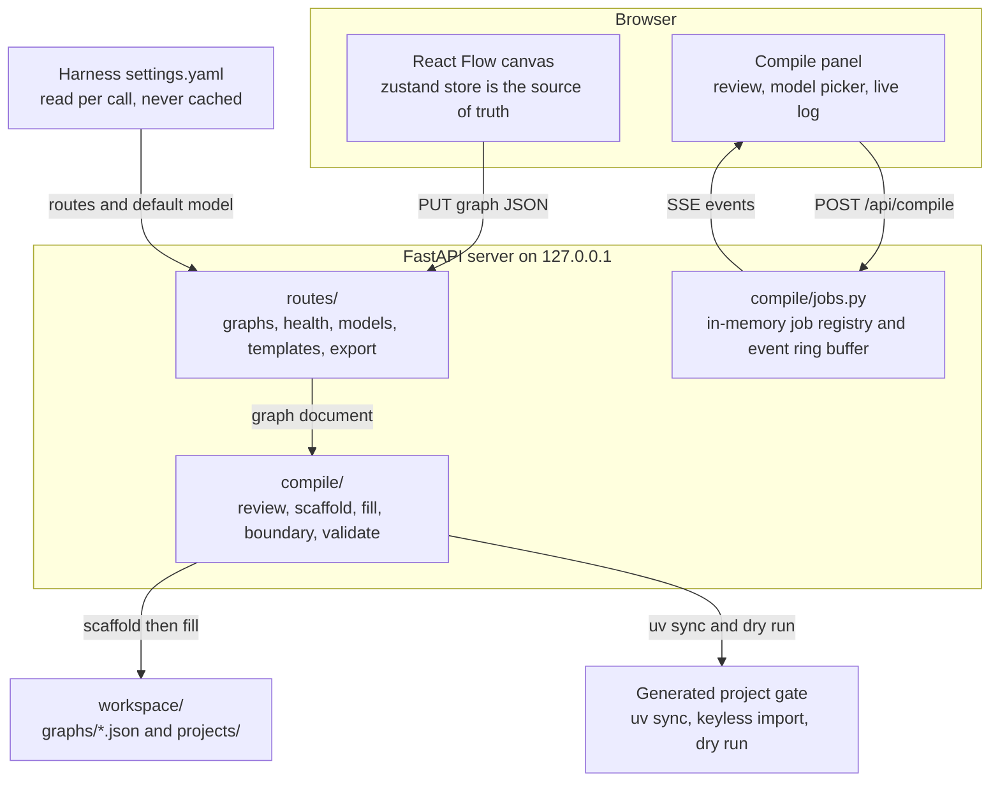

# Swarm Builder — user and operator guide

> The complete manual: install, model configuration, every compile phase, the
> guarantees, and troubleshooting. For the short version start at the
> [repository README](../README.md).

A local-first web app for building PydanticAI agent workflows **visually**: you
drag agent and programmatic nodes onto a canvas, connect them, describe each
node's intent in plain English, and click **Compile**. Swarm Builder fills the
gaps with a PydanticAI coding agent and produces a runnable
[`pydantic-graph`](https://ai.pydantic.dev/graph/) project on disk — then proves
it imports and runs.

It is a standalone Python + React application. You configure its model in the
app itself — pick a provider, paste a key, test it — and can turn on dry run to
work with no credentials at all. It *optionally* also reads
[DeepSeek Harness](https://github.com/deepseek-ai) settings
(`$DSH_HOME/settings.yaml`) to **inherit** an existing set of model routes, but
it does not spawn or depend on `dsh`, it never requires that file, and it works
fully with the harness absent.

| Document | What it covers |
|---|---|
| **this file** | quickstart, model configuration, the compile phases, the guarantees the compile relies on, troubleshooting |
| [`docs/api.md`](api.md) | the HTTP API and the SSE stream contract, including the run and generate endpoints |
| [`docs/architecture.md`](architecture.md) | how the pieces fit, and why |
| `PLAN.md` | the design record: probe facts, rejected alternatives, acceptance criteria (local; not tracked in this repository) |
| `PLAN-V2-FEATURES.md` | the plan and status for Run-from-UI, Describe → generate, and the LangGraph export target (local, likewise) |

---

> ### The model-backed fill is wired
>
> Phase 3 (fill) is an injectable seam, and `routes/compile.py`'s `_run_job`
> resolves the real implementation — `compile/agent.py:fill` — and passes it
> as `filler=` to `run_compile`. So a compile started from the UI or the API
> really does call a model, and finishes end to end when a route is
> configured. `SWARM_FAKE_FILL=1` swaps in a deterministic stub instead, which
> is what makes a keyless, credential-free compile possible.

---

## Quickstart

**Requirements:** [`uv`](https://docs.astral.sh/uv/) on `PATH`. That is all —
`web/dist` is committed, so the canvas is served without a frontend build.
[`pnpm`](https://pnpm.io/) is needed only to *change* the frontend.

Run this from a clean checkout, top to bottom. The `export` is not optional —
see [the trap below](#uv-fails-with-failed-to-initialize-cache-under-cacheuv).

```bash
# 1. uv's default cache (~/.cache/uv) is not writable in every environment.
#    Every uv invocation in this project needs a writable cache, so set it
#    once, in this shell, before anything else. Put it in your shell profile
#    if you like; it must be exported for `uv run swarm-builder` too, because
#    the server's own validation gate shells out to uv.
export UV_CACHE_DIR="$(pwd)/.uv-cache"

# 2. Python dependencies for the server (also creates ./.venv).
uv sync

# 3. Start the server. It prints its URL before it starts serving.
#    Optional: SWARM_FAKE_FILL=1 replaces Phase 3 with a deterministic stub
#    so a compile finishes with no model and no credentials at all.
uv run swarm-builder
# Swarm Builder listening at http://127.0.0.1:8420
```

Open <http://127.0.0.1:8420> for the canvas. `PORT` overrides the port
(default `8420`) and `SWARM_HOST` the interface (default `127.0.0.1`); the
server binds loopback only and has no auth, so it is a developer tool, not
something to expose.

### Changing the frontend

Only if you are editing `web/src/**`. The built bundle is committed, so this
is a maintainer step rather than part of running the app:

```bash
pnpm --dir web install
pnpm --dir web build          # rewrites web/dist, which is committed
uv run python scripts/check_dist.py   # warns if web/dist predates web/src
```

`web/dist` being committed is what makes step 3 above the whole quickstart.
Its cost is that it can drift from `web/src`, so `scripts/check_dist.py`
compares modification times and exits non-zero when the bundle is stale; the
test suite reports the same finding as a warning rather than a failure, since
a stale bundle is a release-hygiene problem rather than a correctness one.

**A note on step 4 and the shell.** `UV_CACHE_DIR` must still be exported in
the server's environment, not just in the shell that ran `uv sync`: Phase 5
runs `uv sync` against the generated project, and the server passes its own
resolved `UV_CACHE_DIR` down to it. If the variable is unset when the server
starts, the cache falls back to `<repo>/.uv-cache` (the built-in default,
which is also writable), so a compile still works — but the value in effect is
whatever the *server's* environment says, and `/api/health`'s `uvCacheDir`
reports it. See the [configuration reference](#configuration-reference).

`uv run uvicorn swarm_builder.main:app --port 8420` also works; note that
`uvicorn`'s own `--port` is then authoritative, because `PORT` is only read
by the console script.

### The fastest way to compile with no credentials at all

The in-app **Dry run mode** switch does this for you; `SWARM_FAKE_FILL=1` is
the same thing for a CI job or a container, and runs the entire pipeline with
**no model, no credentials, and no `$DSH_HOME` at all**. The stub bodies are derived from each node's
declared port types, so a stub-filled project genuinely passes the keyless
validation gate — `uv sync`, keyless import, graph build, the `render()`
golden, and the `TestModel` dry run.

That makes it the right way to exercise the pipeline itself. A *real* compile
needs a resolvable route — see
[Configuring the model](#configuring-the-model) — and differs only in Phase 3:
the bodies come from the model instead of the stub.

### Running a generated project outside Swarm Builder

A generated project has no dependency on Swarm Builder, so it also needs its
own credential when you run it somewhere else: its `.env.example` names the
variable to set (the *name*, never the key value).

Removing or replacing the key in Model settings **does** retract the variable
the app itself published into the running server's environment, so a run
started afterwards cannot authenticate with a credential you revoked. A
variable you exported yourself (in a shell, a `.env` file, or a container) is
left exactly as it is: that one was never the app's to unset.

```bash
export UV_CACHE_DIR="$(pwd)/.uv-cache"
export SWARM_FAKE_FILL=1
uv run swarm-builder &
```

Then, in another shell, drive it over HTTP with no browser involved:

```bash
# Pre-flight: what is configured, what is writable, and whether a compile
# is expected to succeed.
curl -s http://127.0.0.1:8420/api/health | python3 -m json.tool

# Create a graph over the API (a canvas save works the same way), then
# compile it and watch the five phases stream. `-N` disables curl's own
# buffering, which would otherwise hold the whole stream back.
curl -s -X PUT http://127.0.0.1:8420/api/graphs/my-graph \
  -H 'content-type: application/json' \
  -d @my-graph.json

CID=$(curl -s -X POST http://127.0.0.1:8420/api/compile \
        -H 'content-type: application/json' \
        -d '{"graphId":"my-graph"}' | python3 -c 'import json,sys;print(json.load(sys.stdin)["compileId"])')
curl -N http://127.0.0.1:8420/api/compile/$CID/events

# And the result, either way:
curl -s http://127.0.0.1:8420/api/compile/$CID | python3 -m json.tool
```

The whole stream for a three-node graph takes a few seconds, most of it
`uv sync` inside Phase 5. See [`docs/api.md`](api.md#compile-endpoints)
for the full endpoint set.

---

## Run with Docker

If you would rather not install `uv` at all — or want the app isolated from
your Python environment — there is a Compose file that builds the server *and*
the frontend bundle into one image:

```bash
docker compose up --build
# Swarm Builder listening at http://0.0.0.0:8420
# open http://127.0.0.1:8420
```

Same URL and port as the non-Docker path, so nothing about the app changes.

**Try it with no credentials first.** This runs a full five-phase compile with
no model, no `~/.dsh`, and no AWS access — the fastest way to confirm the
container works before wiring anything up:

```bash
SWARM_FAKE_FILL=1 docker compose up --build
```

### What it mounts, and why

| Mount | Why |
|---|---|
| `~/.dsh` → `/home/app/.dsh` | Harness settings, for model-route inheritance. Read per compile, so edits on the host take effect without a restart. |
| `~/.aws` → `/home/app/.aws` | Bedrock credentials. |
| `./workspace` → `/workspace` | Saved graphs and generated projects, so you can read and run an export from the host. |
| `uv-cache`, `venvs` (named volumes) | The uv cache and generated virtualenvs. **Deliberately not bind mounts** — see below. |

**`~/.aws` is mounted read-write on purpose.** Read-only looks safer but breaks
real compiles: boto3 refreshes AWS SSO tokens by *writing* into
`~/.aws/sso/cache`. A container with write access to your credential chain is a
real property of this setup, so it is stated here rather than hidden.

Pass your profile through from the shell (the container cannot read it
otherwise), or put it in a `.env` file next to `docker-compose.yml`:

```bash
AWS_PROFILE=factored-dev-profile AWS_REGION=us-east-1 docker compose up -d
```

**Why the venvs are a named volume.** A Python virtualenv is not portable
across platforms. The container is Linux, so a `.venv` it built would leave
`.venv/bin/python` pointing at a container path that does not exist on macOS,
and compiled dependencies would be Linux binaries — failing with
`bad CPU type` while pure-Python ones still imported, which is a confusing
half-failure. So the container sets `UV_PROJECT_ENVIRONMENT=/venvs/env`, and
`./workspace` receives only portable artefacts: sources, `uv.lock`,
`.python-version`, and the golden diagram.

The practical consequence: an export in `./workspace/projects/<id>/` runs on
your machine with an ordinary `uv sync`. If a `.venv` is ever present there,
remove it first (`rm -rf .venv && uv sync`).

**Published to loopback only.** The container binds `0.0.0.0` internally,
because a process bound to loopback inside a container cannot be reached
through a published port. The app has no authentication, so the Compose file
restores the restriction on the host side with
`127.0.0.1:8420:8420`. Publishing `0.0.0.0:8420` instead would expose an
unauthenticated app to your network.

`docker compose down` stops cleanly in about three seconds: the logs show
`Application shutdown complete`, which means the lifespan hook cancelled any
in-flight compile rather than orphaning it.

---

## Configuring the model

Swarm Builder never pins a model of its own. There are three supported paths,
and `/api/health`'s `resolvedModel.source` field always tells you which one
produced the current answer — `graph-override`, `app-config`,
`settings-default`, `env-fallback`, or `bundle-default`.

### Path A — configure it in the app (the normal way)

Both screens carry a **Model settings** button in their top bar, next to a
summary of the model in use and a `DRY RUN` chip when dry run is on — so what
**Describe your workflow** is about to spend is visible without opening
anything. When something needs doing, the start screen also shows a notice in
the page body with the remedy: **Set up a model** (nothing configured yet),
**Add a key** (a credential is what is missing), or **Fix in Model settings**
(the settings file could not be read).

Fill in the form:

1. **Provider** — OpenAI, Anthropic, DeepSeek, Google Gemini, Groq, Mistral,
   Amazon Bedrock, or *Custom OpenAI-compatible endpoint* (which asks for a
   base URL: vLLM, Ollama, LM Studio, OpenRouter, a corporate gateway).
2. **Model** — exactly one id is ever sent, and the field is pre-filled with a
   current model for the provider you pick (OpenAI `gpt-6-astra`, Anthropic
   `claude-sonnet-5`, DeepSeek `deepseek-v4-flash`, …). The suggestions are
   drawn from the installed `pydantic-ai`'s own model list, so a suggestion is
   always a real model name; any other id the provider accepts works too.
3. **API key** — stored in `workspace/settings.json` with owner-only
   permissions, inside the git-ignored workspace directory. It is published
   into the server process's environment under the provider's own variable
   name (`OPENAI_API_KEY`, `ANTHROPIC_API_KEY`, …), which is how the compile
   agent, the run subprocess and a generated project pick it up. **It is never
   returned by any endpoint** — the screen shows only that a key is stored and
   its last four characters — and it is never written into a generated
   project.
4. **Test connection** — one small real call, so you learn whether the key
   works before spending a whole compile on it.

Changing the base URL of the custom endpoint requires re-entering the key:
the credential must never follow a changed URL to a different host.

Saving takes effect immediately: no restart, no file to edit. Commands below
that read the model state (`/api/health`, `/api/models`) show the result as
`source: app-config`.

Leaving the key field empty is legitimate: the server then uses the
provider's own variable from its environment (an exported `OPENAI_API_KEY`, a
`.env` file, a container secret). `GET /api/health`'s `run_ready` and the Test
button tell you whether a usable credential is actually present.

### Dry run mode

The same screen has one switch: **Dry run mode**. With it on, describe and
compile use deterministic stubs and runs use a keyless test model, so the
whole pipeline works with **no provider, no key and no account** — and the app
badges every screen `DRY RUN` so stub output is never mistaken for real
output. The switch is persisted in `workspace/settings.json`, applies to the
next request without a restart, and is locked (with an explanation) when one
of `SWARM_FAKE_FILL`, `SWARM_FAKE_GENERATE` or `SWARM_RUN_TEST_MODEL` is set
in the environment: an offline or CI run that silently spent real credentials
would be a worse surprise than a switch that cannot be turned off.

### Path B — inherit from the harness (advanced, optional)

Read `$DSH_HOME/settings.yaml` (default `~/.dsh/settings.yaml`). Two sections
matter, everything else in that file is ignored:

```yaml
llm-pi-ai:
  providers:
    amazon-bedrock:
      awsProfile: factored-dev-profile     # `api` inferred as bedrock-converse-stream
      awsRegion: us-east-1
      models:
        - id: us.anthropic.claude-opus-5
          name: Claude Opus 5 (US)
    kornerstone:
      api: openai-completions
      baseURL: http://localhost:8000/v1
      apiKeyEnv: KORNERSTONE_API_KEY
      models:
        - id: qwen38-27b-fp8
          name: Qwen 3.8-27B

agent-default-model:
  provider: amazon-bedrock
  model: us.anthropic.claude-opus-5
```

- **Nothing is cached.** The file is re-read on every request and every
  compile, so editing it takes effect **without a restarting the server** —
  verified live: changing `agent-default-model` between two `/api/health`
  calls changes the reported pair and source immediately.
- **Absent is normal.** If the file, the `llm-pi-ai` section, or
  `agent-default-model` is missing — including when the harness is not
  installed at all — resolution falls through to path B.
- **A route whose protocol has no PydanticAI counterpart is refused at
  Phase 1**, naming the route, before any scaffolding. `/api/models` flags
  it as `unmappable` with a reason, so the picker can disable it up front.
- **Credentials come from the ambient environment.** A Bedrock route
  authenticates through boto3's own chain, including the cached
  `aws sso login` token. See
  [an expired AWS SSO token](#an-expired-aws-sso-token-fails-the-compile).
- **A model id PydanticAI does not know produces a Phase-1 *warning*, not a
  refusal.** The known-name path checks the prefixed name against the
  installed `pydantic-ai`'s `KnownModelName` union
  (`inherit/routes.py:is_known_model_name`) and emits a non-blocking
  `warning` frame with code `unknown_model_name`. It is deliberately a
  warning: the union is pinned to the installed `pydantic-ai`, so a genuinely
  newer provider id must not be refused. **This machine is a live example** —
  the settings here resolve to `deepseek:deepseek-flash`, and only
  `deepseek:deepseek-v4-flash` is in the union. See
  [the compile warns about an unknown model name](#the-compile-warns-about-an-unknown-model-name).

Check what was picked up, without a browser:

```bash
curl -s http://127.0.0.1:8420/api/models | python3 -m json.tool
```

### Path C — set `SWARM_MODEL`

For a machine with no harness at all, or to override the configured route for
one shell:

```bash
# A PydanticAI known model name -- the usual case.
export SWARM_MODEL="bedrock:us.anthropic.claude-opus-5"
export AWS_PROFILE=factored-dev-profile

# Or a custom OpenAI-compatible endpoint: a BARE model id plus a base URL,
# and the *name* of the environment variable holding the key (never the key
# itself, which is why the key can stay out of .env files).
export SWARM_MODEL="qwen38-27b-fp8"
export SWARM_BASE_URL="http://localhost:8000/v1"
export SWARM_API_KEY_ENV="KORNERSTONE_API_KEY"
export KORNERSTONE_API_KEY="sk-..."
```

These can also live in a `.env` file at the repository root: `uv run
swarm-builder` loads it at startup (a value already exported in the shell
wins; empty `KEY=` lines are ignored). That is the same file `docker compose`
reads, so one `.env` serves both. Provider keys such as `DEEPSEEK_API_KEY` or
`OPENAI_API_KEY` belong there too — the fill agent, **Describe → generate**
and every **Run** subprocess read them from the server's environment.

`SWARM_MODEL` is only consulted when nothing else is configured, so the
precedence is: **graph override → the model saved in Model settings
(`app-config`) → `agent-default-model` → `SWARM_MODEL` → built-in offline
default** (`deepseek-official` / `deepseek-v4-flash`, reported with
`source: "bundle-default"` and treated as *not configured*). Whichever source
wins supplies the whole selection — provider, model, endpoint and key together
— so a pair no single source declares can never be resolved.

### Per-workflow override

A graph's own `model` field wins over everything. Set it from the compile
panel's picker (a dropdown of routes from `/api/models`, plus a free-text
field for catalog-only routes that settings cannot enumerate), or directly in
the document:

```json
{ "provider": "amazon-bedrock", "model": "us.anthropic.claude-opus-5", "reasoningEffort": null }
```

### You are never silently routed to the wrong model

The resolved route **and its source** are reported in three places, all
reading the same resolution:

- `GET /api/health` → `resolvedModel: {provider, model, source}`
- `GET /api/models` → `resolvedDefault: {provider, model, source}`
- the compile panel's picker, which shows the inherited route and its source
  before you press Compile — and the compile's `done` event, which echoes the
  model that was actually spent.

The one exception worth knowing: a route with a declared `baseURL` **always**
emits the structural `OpenAIChatModel`/`OpenAIProvider` form, even when its
model id happens to look like a known PydanticAI name. Otherwise a
self-hosted route whose id is also an official one (this repo's settings have
exactly that shape) would silently be sent to the official API. The rule and
its reasoning are in
[`docs/architecture.md`](architecture.md#model-route-inheritance-and-the-two-emission-paths).

---

## Architecture



The graph document is defined **once**, as pydantic models in
`src/swarm_builder/models.py`; the frontend's TypeScript types are generated
from the server's own OpenAPI document by
`uv run python scripts/generate_web_types.py` rather than hand-maintained. One
schema, two consumers, no drift.

Two properties follow from that:

- **The compile is template-first.** The server emits every structural file —
  including all graph wiring — and asks the model only for the marked body
  regions of `steps/<id>.py`. A model mistake cannot corrupt graph structure.
- **There is no subprocess boundary.** The fill agent runs in the server
  process and calls the model provider directly. The only harness contact is
  *reading* its settings file. Cancelling a compile is cancelling one asyncio
  task.

Full detail, including the graph document's camelCase-on-the-wire convention
and the two-tier boundary check, is in
[`docs/architecture.md`](architecture.md).

### The five compile phases

| # | Phase | Deterministic? | What happens |
|---|---|---|---|
| 1 | `review` | **yes** | Static validation of the document — cycles, orphans, lossy fan-out, branchless decisions, port-type mismatches, state ownership — plus model-route resolution. **Any error refuses the compile before anything is written to disk.** `POST /api/graphs/:id/review` runs this on demand. |
| 2 | `scaffold` | **yes** | Emit the complete project from templates, capture the `graph.render()` golden diagram, and snapshot the boundary baseline. A recompile rescaffolds from scratch; existing files are cleared only *after* Phase 1 passes. |
| 3 | `fill` | **no — the only model call** | One in-process PydanticAI agent writes the marked body regions of `steps/<id>.py`, then self-verifies — with a tool that **parses**, never executes (see [Phase 3 cannot execute code](#phase-3-cannot-execute-code)). Bounded by `Agent(retries=3)`, `UsageLimits(request_limit=80, tool_calls_limit=120)`, and a 600 s wall-clock timeout. |
| 4 | `boundary` | **yes** | Two-tier check: forbidden files byte-identical to the Phase-2 baseline by SHA-256; permitted files parsed into marker regions with everything *outside* the markers hashed and compared. Also flags any file created outside the scaffolded set — apart from the run artifacts Phase 5 itself writes (`uv.lock`), which are excluded. |
| 5 | `validate` | **yes** | A static `pyproject.toml` extras assertion, then `uv sync`, then a keyless import, then the generated project's own `validate/dry_run.py` — **with no credentials at all**. |

Phase 3 is retried **at most once**, and only when phase 4 or phase 5 fails,
with the failure text appended to the retry. A second failure is reported, not
retried. A failed compile always leaves the project on disk for inspection.

Every phase streams SSE events (`phase`, `log`, `warning`, `done`, `error`)
with a monotonic per-job `id`, so a reloaded tab can resume with
`Last-Event-ID` and replay strictly after its cursor. That contract is
specified precisely in [`docs/api.md`](api.md#sse-event-stream).

---

## Run a workflow from the UI

The compile drawer has a second tab, **Run**. Type an input for the entry node
(a plain string, or JSON for a `json`/`list[str]` port), press **Run**, and
watch the canvas: the active node pulses, finished nodes turn green, a failed
node turns red. The panel shows the step trace with per-step timings, the
final output, the final `State`, and the last 20 runs for this graph; the
Inspector shows a selected node's last inputs and output under **Last run**.

**Run compiles first when it has to.** If the graph has never been compiled,
or has been edited since, the run streams the five compile phases and then
executes — one button, no separate step to remember. A project compiled
before this feature existed is also treated as stale (it has no tracer).

**What actually runs.** The generated project's own `run/stream_run.py`,
under `uv run`, in the project directory, with the environment the server was
started with. That is the same subprocess boundary Phase 5's dry run already
crosses, with one deliberate difference: **credentials are passed through**,
because a run that cannot reach a model would be pointless. Generated step
bodies are model-written code, so a run executes model-written code on your
machine with your keys. The bounds are a 15-minute wall-clock timeout, a
process-group kill on cancel or timeout, no shell (the input travels in a
file), and the health check: `GET /api/health` now reports `runReady` and
`runBlockers`, and the button is disabled until the resolved route's
credential is present in the server's environment. Nothing sandboxes the
subprocess's filesystem or network beyond that.

A run is a job in the same registry as a compile — same `Last-Event-ID`
resume after a reload, same cancel, and one live job per graph. History is
written to `workspace/runs/<graphId>/`. See
[`docs/api.md`](api.md#run-endpoints) for the endpoints and frames.

To exercise the run plumbing with no credentials at all, start the server
with `SWARM_FAKE_FILL=1 SWARM_RUN_TEST_MODEL=1`: the compile stubs the fill
and the run injects a keyless `TestModel`, so every step still reports.

## Generate a graph from a description

On the start screen, **Describe a workflow** takes a paragraph of prose and
returns a whole graph: nodes, edges, state fields, laid out left to right,
already saved, and already clean under the same review the compile runs. In
the workspace, **Describe…** in the toolbar does the same for the current
graph after a confirmation, replacing the canvas.

The model only drafts titles, kinds, intents, and edges between titles.
Everything the document's invariants depend on is derived by the server:
node ids come from the same slugifier the canvas uses, decision branches from
the branch edges, fan-out/join wiring from the shape, positions from a
layered layout. The reviewer's errors are fed back to the model for up to two
repair rounds; if it still cannot produce a clean graph, the panel shows the
remaining findings instead of an unusable canvas. Expect to edit the result —
that is what the Inspector is for — but expect it to compile.

Generation needs a configured model route (the same one a compile uses). With
`SWARM_FAKE_GENERATE=1` the model is replaced by a deterministic
sentence-per-step draft, which is how the endpoint and the panel are tested.

## Export to LangGraph

The compile panel has a **Target** picker. *PydanticAI + LangGraph export*
runs the usual five phases, then four more that turn the **validated**
PydanticAI project into a LangGraph project under
`workspace/projects-langgraph/<graphId>/`:

| # | Phase | What it does |
|---|---|---|
| 6 | `lg_scaffold` | Deterministic. Emits `pyproject.toml` (pinned `langgraph` 1.2.12, `langchain` 1.4.2, `langchain-core` 1.6.4, plus the LangChain partner package for the inherited route), `state.py` (a `TypedDict` with a `payload` channel, the canvas state fields, and one reducer channel per join), `context.py` (a `Runtime` context carrying the LangChain chat model), `graph.py` (the `StateGraph` wiring), one `nodes/<id>.py` per canvas node, and `validate/dry_run.py` with a Mermaid golden. |
| 7 | `lg_convert` | The one model call. A conversion agent reads each filled `steps/<id>.py` of the PydanticAI project and writes the equivalent body into the marker region of `nodes/<id>.py`. Only `programmatic` bodies need converting: agent, decision and join nodes are complete templates. Retried once if 8 or 9 fails. |
| 8 | `lg_boundary` | The same two-tier boundary check as Phase 4, over `nodes/`. |
| 9 | `lg_validate` | `uv sync`, keyless import, and the project's own dry run: Mermaid golden, node set, and a full `ainvoke` against a keyless fake chat model. |

**What the export looks like.** Orchestration is pure LangGraph:
`StateGraph`, `START`/`END`, `add_conditional_edges` for decisions
(a decision is a pass-through node whose routing function maps the previous
step's return value to a branch, exactly as pydantic-graph dispatches),
one `add_edge` per fan-out arm and `add_edge([arms], join)` for fan-in, with
arms writing into the join's reducer channel. LangChain appears only where a
model is called: `init_chat_model` (or `ChatOpenAI` for a custom base URL),
`langchain.messages`, and `@tool` for orchestrator delegation. No
`create_agent`, no `create_react_agent`, no LCEL. Each node module has the
editable body function `async def <id>_body(inputs, state, model, writes)`
and a generated wrapper that builds the state update. In both targets an agent node that declares `reads`
receives those state fields as context lines under its input, so a declared
read is never decorative.

Supported routes: OpenAI, Anthropic, DeepSeek, Bedrock (`bedrock_converse`),
and any OpenAI-compatible base URL. Another provider fails `lg_scaffold` with
a clear message. A `websearch` agent node is emitted as a plain chat call with
a comment where to bind a search tool.

`GET /api/graphs/:id/export?target=langgraph` reports the export's path and
run command. **Run** always executes the PydanticAI project. Under
`SWARM_FAKE_FILL=1` the conversion is a deterministic stub, so the whole
nine-phase compile works with no credentials.

## Running the tests

```bash
export UV_CACHE_DIR="$(pwd)/.uv-cache"

# Python: server, codegen, pipeline, boundary, fill agent.
uv run pytest

# Some tests are marked `slow` because they run a real `uv sync` against a
# scaffolded project (about 40 s of the suite's 70 s). Skip them for a fast loop:
uv run pytest -m "not slow"

# Lint.
uv run ruff check

# Frontend: Vitest.
pnpm --dir web test

# Regenerate web/src/types.ts + openapi.json after changing a route's
# request/response shape or models.py (no server needs to be running).
uv run python scripts/generate_web_types.py
```

Current counts on this checkout: **323 Python tests** (23 of them `slow`) and
**62 Vitest tests** across 9 files. Measured just now: `uv run pytest -q`
takes ~72 s and reports `323 passed`; `uv run pytest -q -m "not slow"` takes
~30 s and reports `300 passed, 23 deselected`; `pnpm --dir web test` reports
`62 passed (62)` in under 2 s; `pnpm --dir web build` succeeds. The `slow`
marker is registered in `pyproject.toml` under `[tool.pytest.ini_options]`, so
there is no `PytestUnknownMarkWarning`; its own description is
`exercises uv sync + a real subprocess`.

The codegen suite is the important one: it scaffolds each of the **seven
positive fixtures**, runs the real keyless validation gate against every one,
and asserts the things a naive check would miss — `render()` against a
per-fixture golden diagram, the exact `graph.nodes` key set (which catches the
silently dropped orphan), and that a `join` fixture returns the joined
collection rather than one arbitrary branch. The seventh, `json_ports`, is the
regression fixture for the `json` `PortType` — see
[the `json` port type](#the-json-port-type). Negative fixtures prove Phase 1 —
not `pydantic_graph` — is what rejects cycles, orphans, branchless decisions,
and joinless fan-outs.

---

## What a generated project contains

Everything lands in `workspace/projects/<graphId>/` (override the workspace
root with `SWARM_WORKSPACE`):

```
workspace/projects/<graphId>/
  pyproject.toml            deps = the route's extras + template deps + programmatic `needs`
  .python-version           pins the interpreter the codegen suite validates against
  README.md                 the inherited route and how to run this project
  .env.example              the route's environment lines: SWARM_MODEL for a
                            known-name route, or SWARM_MODEL + SWARM_BASE_URL
                            + SWARM_API_KEY_ENV for a custom-baseURL route
  src/swarm_workflow/
    __init__.py
    state.py                @dataclass State, from the canvas's stateFields
    deps.py                 @dataclass Deps carrying the model, plus env resolution
    graph.py                GraphBuilder wiring -- generated, never model-written
    steps/<node_id>.py      one module per step node, with marker regions
    agents/<node_id>.py     one agent factory per agent node
  validate/
    dry_run.py              the project's own TestModel-injected gate
    golden_render.txt       the expected graph.render() output, captured at scaffold time
  run/
    stream_run.py           the tracer the UI's Run button executes: one JSON line per step
```

`graph.py`, `state.py`, `deps.py`, `pyproject.toml` and everything under
`validate/` and `run/` are regenerated on every recompile and are never model-written.
Only the marker regions in `steps/*.py` and `agents/*.py` are editable by the
fill agent.

### Running it standalone

The project is self-contained: it has its own `pyproject.toml`, its own
pinned interpreter, and no dependency on Swarm Builder or the harness.

```bash
# The exact command the UI's export panel gives you:
cd workspace/projects/<graphId>
UV_CACHE_DIR=/path/to/writable/cache uv sync
UV_CACHE_DIR=/path/to/writable/cache uv run python -c "import swarm_workflow.graph"
UV_CACHE_DIR=/path/to/writable/cache uv run python validate/dry_run.py
```

All three must succeed **with no API key and no AWS credentials present** —
the dry run injects `TestModel()`. This was verified by copying a generated
project to a different directory, deleting its `.venv` and `uv.lock`, and
running it with a *fresh* cache and every provider credential variable
unset:

```
OK render() matches golden
OK graph.nodes == ['__end__', '__start__', 'chat_step', 'intake', 'summarize']
OK graph.run() returned: 'success (no tool calls)'
ALL CHECKS PASSED
```

To run the workflow for real, set `SWARM_MODEL` in the project's environment
(plus `SWARM_BASE_URL`/`SWARM_API_KEY_ENV` for a custom endpoint). The route
inherited at compile time is written into `README.md` as only a *default*, so
the export stays portable to a machine with different credentials.

`.env.example` is a real, non-empty starting point on **both** emission paths:
a known-name route writes `SWARM_MODEL=<prefix>:<model>` (here,
`SWARM_MODEL=deepseek:deepseek-flash`), and a custom-`baseURL` route writes
`SWARM_MODEL`, `SWARM_BASE_URL` and `SWARM_API_KEY_ENV`. Scaffolding always
creates the file, so a recompile cannot leave a stale one behind.

### Configuration reference

| Variable | Default | Purpose |
|---|---|---|
| `SWARM_CONFIG` | `<workspace>/settings.json` | Where the app's **own** model settings live: the provider, model id, API key and the dry-run switch chosen in **Model settings**. Owner-only (`0600`) and inside the git-ignored workspace. Absent is a normal state. |
| `DSH_HOME` | `~/.dsh` | Where to look for `settings.yaml` to *inherit* model routes from an existing harness configuration. Absent is a normal state, and never required. |
| `SWARM_WORKSPACE` | `<repo>/workspace` | Where saved graphs and generated projects live. |
| `PORT` | `8420` | Port the console script binds on. |
| `SWARM_HOST` | `127.0.0.1` | Interface the console script binds on. Loopback is a deliberate security default — the server has no auth. Only the container sets `0.0.0.0`, because a loopback bind inside a container is unreachable through a published port; the Compose file re-establishes the restriction by publishing to host loopback. |
| `UV_CACHE_DIR` | `<repo>/.uv-cache` | Cache `uv` uses for the server's sync, the fill agent's checks, and every generated project's validation gate. |
| `SWARM_MODEL` | *(none)* | Fallback model when no route is inherited: a PydanticAI known name, or a bare id paired with `SWARM_BASE_URL`. |
| `SWARM_BASE_URL` | *(none)* | Custom OpenAI-compatible endpoint for a `SWARM_MODEL` that is not a known name. |
| `SWARM_API_KEY_ENV` | *(none)* | *Name* of the environment variable holding that endpoint's key. The key value itself is never written to disk. |
| `SWARM_FAKE_FILL` | *(none)* | `1` selects the deterministic stub fill instead of the model: no credentials needed. Also forces the in-app **Dry run mode** switch on (and locks it). |
| `SWARM_FAKE_GENERATE` | *(none)* | `1` replaces the model in **Describe → generate** with a deterministic sentence-per-step draft. Also forces dry run on. |
| `SWARM_RUN_TEST_MODEL` | *(none)* | `1` makes a **Run** execute the generated project against a keyless `TestModel` instead of the real model — for exercising the run plumbing, never for real output. Also forces dry run on. |

`.env.example` is a copy-pasteable starting point: copy it to `.env` and the
console script loads it at startup. Only `swarm-builder` (and `docker
compose`) read `.env`; a bare `uvicorn swarm_builder.main:app` does not.

---

## Guarantees the compile relies on

Three properties that are load-bearing rather than incidental. Each has been
verified against this checkout, and each is the kind of thing a reader would
otherwise have to reconstruct from the code.

### Phase 3 cannot execute code

The fill agent gets exactly three tools — `read_file`, `write_region` and
`parse_check` — and **none of them runs model-authored Python**.

`parse_check(names?)` is the self-verification tool: it reads the step modules
through the same confinement guard every other tool uses and calls
`ast.parse` **in this process**. It executes nothing, installs nothing, and
imports nothing from the generated project, so the agent spawns **no
subprocess at all** and its filesystem reach really is the project directory.

That is the whole security argument, and it is why the tool is narrow. The
tool it replaced ran arbitrary snippets in a subprocess, and was verified
writing a file *outside* the project directory — where Phase 4, which only
walks the project directory, cannot see it. Since the only verification the
prompt ever asked for was a syntax check over the modules just written,
narrowing the tool to exactly that loses no real capability and makes the
confinement invariant true by construction instead of true by prompt
instruction. Phase 5 is what actually executes the graph. The full record is
in the local `PLAN.md` (the "Amendment (implementation)" note under Phase 3
and assumption 9).

A fill run that legitimately has nothing to write — a graph whose every step
is an `agent` node, already complete after Phase 2 — is **success**, not a
failure. Only `programmatic` nodes have an unfilled body to replace, and
`compile/agent.py` imports that set from `compile/fake_fill.py` so the real
and stub fillers cannot disagree about it.

### The `json` port type

`json` is one of the three legal `PortType` values, and it goes through the
shared tables in `models.py` like any other — **a `PortType` is never
interpolated verbatim into generated source**, because the label `json` is not
a valid Python annotation:

| `PortType` | Annotation (`PORT_TYPE_ANNOTATIONS`) | Import (`PORT_TYPE_IMPORTS`) |
|---|---|---|
| `str` | `str` | *(none)* |
| `list[str]` | `list[str]` | *(none)* |
| `json` | `dict[str, Any]` | `from typing import Any` |

Two defects in the `json` path shipped once and are now fixed, both covered by
the `json_ports` fixture:

- `emit_graph.py` decided whether `graph.py` needed `from typing import Any`
  by testing the rendered annotation, but the annotation for a `json` port is
  the *string* `"dict[str, Any]"`, so the test never matched and the emitted
  module raised `NameError` at import. The emitter now asks
  `PORT_TYPE_IMPORTS` which import a port type needs.
- The three agent templates hardcoded `Agent[None, str]`, so a `json`-output
  agent node returned a `str` and failed Phase 5's output-type check. The
  templates now take the node's declared output port type for both the
  factory's `output_type=` and its return annotation.

### The fill retry survives Phase 5's lockfile

Phase 5 runs `uv sync`, which writes `uv.lock` into the project directory — a
file that was not in the Phase-2 baseline. Phase 4's "unexpected new file"
tier counts anything outside the scaffolded set, so on a retry it reported a
boundary violation naming a file the model never touched, instead of the
dry-run failure that triggered the retry. Every phase-5-failure retry — the
one case the retry policy exists for — ended that way.

`uv.lock` is now excluded from the boundary walk, alongside `__pycache__`,
`.pyc`/`.pyo`, `.venv` and `.git`, all of which are produced by *running*
Python against the project rather than by scaffolding it. A genuinely
unexpected file is still caught: verified by writing `uv.lock` and
`__pycache__/x.pyc` next to a baseline and getting zero violations, then
adding `notes.txt` and getting exactly `unexpected_new_file (notes.txt)`.

---

## Troubleshooting

One entry per documented failure mode. Each gives the **symptom** you will
actually see, the **cause**, and the **fix**.

### Docker: `docker compose up` fails, or hangs with no output

**Symptom**

Either the command fails with a `Cannot connect to the Docker daemon` error, or
it appears to hang; `docker info` also hangs rather than printing a version.

**Cause**

The daemon is not running. Docker Desktop may be installed and the CLI present
while the daemon is stopped or still starting — the socket can exist and still
be idle, which is what makes this look like a hang rather than a failure.

**Fix**

Start Docker Desktop and confirm the daemon answers before building:

```bash
docker info --format '{{.ServerVersion}}'
docker compose config     # validates the Compose file; needs no daemon
```

If `docker compose build` reports
`open ~/.docker/buildx/refs/...: operation not permitted`, that is a sandboxed
or restricted shell rather than a Docker problem: the build needs write access
to your Docker state directory outside the project.

### Docker: the container exits at once with `PermissionError` on a source file

**Symptom**

```
PermissionError: [Errno 13] Permission denied: '/app/src/swarm_builder/__init__.py'
```

**Cause**

Source files checked out on macOS can carry restrictive modes (`-rw-------`).
Copied into the image as root, they are unreadable by the non-root `app` user
the container runs as.

**Fix**

The Dockerfile already handles this with `chown -R app:app /app`. If you change
the Dockerfile's user or copy steps, keep an equivalent `chown` — the failure
otherwise appears only at container start, as a permission error on a file the
server legitimately needs to read.

### Docker: `No download found for request: cpython-3.14.5-linux-aarch64-gnu`

**Symptom**

The image build fails at `uv sync`, or a compile fails in the scaffold or
validate phase inside the container, reporting that the pinned interpreter is
unavailable.

**Cause**

`.python-version` pins the interpreter generated projects inherit from this
repo. The `uv` bundled in the base image can be too old to download that exact
patch version — at the time of writing the image shipped CPython 3.14.2 with
`uv` 0.9.30, which could fetch only up to 3.14.3, while this repo pins 3.14.5.

**Fix**

The Dockerfile installs a pinned current `uv` and pre-installs the pinned
interpreter. If you bump `.python-version` or the base image, revisit the
`UV_VERSION` build arg — this failure is the signal that the two have drifted.

### `uv` fails with `Failed to initialize cache` under `~/.cache/uv`

**Symptom**

```
error: Failed to initialize cache at `/Users/you/.cache/uv`
  Caused by: failed to open file `/Users/you/.cache/uv/sdists-v9/.git`:
  Operation not permitted (os error 1)
```

**Cause** — `~/.cache/uv` is not writable in this environment. This is the
single most likely thing to trip up a new checkout, and it reads like a
dependency problem when it is not.

**Fix** — point `uv` at a writable directory and **export** it, in every
shell that runs any `uv` command, including the one that starts the server:

```bash
export UV_CACHE_DIR="$(pwd)/.uv-cache"
uv sync
```

Add it to your shell profile if you would rather not repeat it. The server's
Phase-5 validation gate runs `uv sync` itself and passes its own resolved
`UV_CACHE_DIR` down. The fill agent spawns no subprocess at all.

### `Unable to find package manager binary: cannot find binary path`

**Symptom** — `/api/health` reports `"uvAvailable": false`, `"compileReady":
false`, the Compile button is disabled with an explanatory message, and any
`uv ...` command fails with `command not found`.

**Cause** — `uv` is not on the `PATH` of the process running the server.

**Fix** — install `uv` (<https://docs.astral.sh/uv/>) and make sure the
directory containing it is on `PATH` for the server's process, then restart
the server. This is reported **before** any compile rather than failing
mid-compile, so re-check `/api/health` — `uvAvailable: true` means you are
good.

### `GET /` returns `{"message": "Swarm Builder's frontend has not been built yet..."}`

**Symptom** — the API works, but the port serves a JSON message instead of a
canvas. `/api/health` reports `"webDistPresent": false`.

**Cause** — `web/dist/index.html` does not exist, so the server registers its
explanatory fallback for `/` instead of mounting the static build. The server
degrades rather than failing: **every `/api/*` endpoint keeps working**. The
check happens per `create_app()` call, so a build produced while the server
is running is picked up on restart.

In a normal checkout this should not happen: `web/dist` is committed, precisely
so that running the app never requires a frontend build. Seeing this message
means the directory was deleted, or `.gitignore` was edited in a way that
dropped the `!web/dist/**` negation.

**Fix**

```bash
pnpm --dir web install
pnpm --dir web build      # writes web/dist/
uv run python scripts/check_dist.py   # confirms it is now present and current
```

Then reload the canvas. To iterate on the frontend instead, run
`pnpm --dir web dev` and use its dev server: `web/vite.config.ts` proxies
`/api` to `http://127.0.0.1:8420`, so the browser never makes a cross-origin
request — which also means no CORS preflight for the non-safelisted
`Last-Event-ID` header the SSE client sends on reconnect. **Leave the API on
port 8420** for this to work, or edit the proxy target to match your `PORT`.

### No model configured yet — `compileReady: false`

**Symptom**

```json
"resolvedModel": { "provider": "deepseek-official", "model": "deepseek-v4-flash", "source": "bundle-default" },
"modelConfigured": false,
"compileReady": false,
"blockers": ["No model is configured yet. Choose a provider and add your API key in Model settings, or turn on Dry run mode to build and run offline."]
```

**Cause** — nothing is configured, so the built-in offline stand-in applies.
`source: "bundle-default"` (or `modelConfigured: false`) is the exact tell.
This is the state a fresh clone starts in: a **normal, expected state**, not a
crash, and the app never presents it in terms of anything outside itself.

**Fix** — either:

- **Model settings → provider → API key → Save**, then **Test connection**; or
- **Model settings → Dry run mode**, which needs no account at all.

Re-check `/api/health` until `modelConfigured` is `true` (or `dryRun` is `true`)
and `blockers` is empty. On the advanced path, an `agent-default-model` section
in `$DSH_HOME/settings.yaml` or `SWARM_MODEL` in the environment also count —
both are read, but neither is required.

### An expired AWS SSO token fails the compile

**Symptom** — the compile fails in Phase 3 with the provider's own message,
something like `Token has expired and refresh failed`, `The security token
included in the request is expired`, or an `SSOTokenLoadError` /
`UnauthorizedSSOTokenError`, on a route whose `key` is `amazon-bedrock`. The
`error` event names the route in the preceding `log` frame.

**Cause** — Bedrock routes authenticate through boto3's own credential chain,
including the cached AWS SSO token created by `aws sso login`. Swarm Builder
holds no credentials of its own and cannot refresh that token.

**Fix**

```bash
aws sso login --profile factored-dev-profile   # the profile named by the route
curl -s http://127.0.0.1:8420/api/health | python3 -m json.tool   # confirm the route
```

Then recompile. The profile is the `awsProfile` value on the route in
`settings.yaml`; `AWS_PROFILE` in the server's environment is what boto3
actually reads.

### A route has no PydanticAI counterpart

**Symptom** — the compile is refused in Phase 1, before anything is written to
disk, with a `phase` event whose `status` is `failed`:

```
route 'my-route' (api=my-custom-protocol) has no usable PydanticAI mapping:
api protocol has no PydanticAI counterpart
```

and `/api/models` shows that route with `"emission": "unmappable"` and a
`unmappableReason`.

**Cause** — the route's `api` protocol cannot be mapped onto a PydanticAI
model class, and it has no `baseURL` to build a structural model from. The
mappable protocols are `openai-completions` and `openai-responses` →
`OpenAIChatModel`/`OpenAIResponsesModel`, `anthropic-messages` →
`AnthropicModel`, and `bedrock-converse-stream` → `BedrockConverseModel`. The
refusal is deliberate: the alternative is emitting a project that cannot
import.

**Fix** — choose a different provider in **Model settings** (all curated
providers are usable in-process), or set the graph's own `model` override, or —
on the inherited path — change the route in `settings.yaml`:

- if the endpoint is OpenAI-compatible, pick *Custom OpenAI-compatible
  endpoint* in Model settings (which asks for a base URL and takes the
  structural path), or declare `api: openai-completions` plus a `baseURL` in
  an inherited route;
- otherwise use `SWARM_MODEL` with a PydanticAI known name for this compile.

**Also note the extra.** An inherited `anthropic-messages` route needs the
`anthropic` extra. This server pins
`pydantic-ai-slim[anthropic,bedrock,google,groq,mistral,openai]` so every
provider the picker offers can be built in-process; an install that somehow
lacks one reports it in `/api/models` as `unmappableReason`, and the fix is a
`uv sync`.

### `uv sync` fails inside Phase 5

**Symptom** — the compile fails in Phase 5 with the full `uv` resolver output
in the message, e.g.

```
validation step 'uv_sync' failed (exit 1) for project .../projects/my-graph; stderr tail:
  × No solution found when resolving dependencies:
  ╰─▶ Because definitely-not-a-real-package was not found in the package registry
      and your project depends on definitely-not-a-real-package==1.0.0, ...
```

The `error` event's `details` carries `{"step": "uv_sync", "returncode": 1,
"command": ["uv", "sync"]}`. The project directory is left on disk.

**Cause** — almost always a **programmatic node's `needs` list**: those strings
are unioned verbatim into the generated `pyproject.toml`, so a typo, a
nonexistent version pin, or a version that conflicts with the template's
pinned `pydantic-ai-slim`/`pydantic-graph` 2.43.0 makes the whole project
unsatisfiable. The resolver output names the offending package directly.

**Fix**

1. Read the `stderr tail` in the failure — it names the package and the
   conflict. Then open the failing project's `pyproject.toml` and inspect the
   generated dependency list.
2. Correct the offending `needs` entry on the programmatic node in the
   canvas (or the node's `signatureHint` if that is where the temptation to
   add a package came from), and recompile. A recompile clears and
   rescaffolds the project from scratch, so no manual cleanup is needed.
3. To iterate on the dependency list by hand without recompiling:

   ```bash
   cd workspace/projects/<graphId>
   UV_CACHE_DIR=/path/to/writable/cache uv sync
   ```

   Note that a manual `uv sync` here writes `uv.lock`. That is safe: Phase 4's
   boundary walk **excludes** `uv.lock` (along with `__pycache__`, `.pyc`/
   `.pyo`, `.venv` and `.git`), because Phase 5's own `uv sync` writes it and
   counting it would make every phase-5-failure retry report a boundary
   violation instead of the real dry-run error. A hand-edit to any
   *scaffolded* file, on the other hand, will fail the boundary check on the
   next compile; that is on purpose.

### The fill times out, or trips its usage limit

**Symptom** — the compile fails in Phase 3 with one of:

```
fill did not finish within 600s (a wedged model cannot hang a compile indefinitely)
fill run exceeded its usage limit: The next request would exceed the request_limit of 80
```

The `error` event's `details` carries the exception type
(`TimeoutError`, `UsageLimitExceeded`, or `FillError`).

**Cause** — three distinct bounds, all in `compile/agent.py` and
`compile/jobs.py`:

| Bound | Value | Trips when |
|---|---|---|
| wall clock | 600 s (`FILL_TIMEOUT_SECONDS`) | the model wedges, or the provider never returns |
| `request_limit` | 80 | the model keeps making provider round trips without finishing |
| `tool_calls_limit` | 120 | the model keeps calling `read_file`/`write_region`/`parse_check` |

A graph with more than ~40 nodes is explicitly documented as a case where one
fill run may exceed a comfortable context; there is no batching path in v1.
A flash-class model on a large graph is the common real cause.

**Fix**

- **Split the graph.** Compile two smaller graphs instead of one large one. A
  graph with *N* fillable nodes needs roughly 3*N* requests, so 80 requests
  is about 25 nodes of headroom.
- **Switch to a stronger model** with the compile panel's picker, or set the
  graph's `model` override to a larger model for this one workflow.
- **Check the previous attempt.** If the failure was phase 4 or 5 rather than
  the fill itself, the pipeline already retried once with the failure text
  appended; the second `fill` phase event with the same `started` status in
  the log is that retry.
- **Confirm the model is alive at all** by re-running the compile; a wedged
  endpoint rather than a hard failure usually shows up as the 600 s timeout
  with no `log` frames in between.

To raise a bound for a session, change the constants in
`src/swarm_builder/compile/agent.py` (`REQUEST_LIMIT`, `TOOL_CALLS_LIMIT`) or
`src/swarm_builder/compile/jobs.py` (`FILL_TIMEOUT_SECONDS`) and restart the
server. Token and cost caps are deliberately left unset — see
[`docs/architecture.md`](architecture.md#marker-regions-and-the-two-tier-boundary-check).

### The fill is refused as a boundary violation

**Symptom** — the compile fails in Phase 4, naming one or more paths:

```
projects/my-graph/src/swarm_workflow/graph.py was modified
projects/my-graph/src/swarm_workflow/steps/intake.py was edited outside its marker regions
projects/my-graph/src/swarm_workflow/steps/intake.py has an empty body region
projects/my-graph/notes.txt was created outside the scaffolded set
```

The `phase` event's `details` carries the full list as
`violations: [{code, message, path}]`, with codes

| Code | Meaning |
|---|---|
| `forbidden_file_changed` | A whole-file-hashed file differs from the Phase-2 baseline. |
| `missing_scaffolded_file` | A scaffolded file was deleted. |
| `missing_marker` | A `steps/`/`agents/` module lost one of its four marker lines. |
| `empty_body_region` | A body region is empty after the fill — the fill did not happen. |
| `outside_marker_text_changed` | Text *outside* the marker regions was edited. |
| `unexpected_new_file` | A file exists that was not part of the scaffolded set. |

**Cause** — Phase 3 is expected to touch **only** the `imports` and `body`
marker regions of `steps/<node_id>.py`. The check is two-tier on purpose: a
whole-file hash cannot cover files the fill legitimately rewrites, so the
outside-marker text is hashed instead. All violations are reported at once,
never just the first. Note that `__pycache__`, `.pyc`/`.pyo`, `.venv`, `.git`
and `uv.lock` are excluded, so bytecode caching and Phase 5's own lockfile are
not violations.

The tools enforce this rather than merely requesting it — `write_region` is
the agent's *only* mutator, and every path goes through a
`resolve()` + `is_relative_to` guard *before any I/O*. So a violation here
means one of:

1. a **template or emitter bug** that emitted a malformed marker set (the
   likely cause for `missing_marker` or `empty_body_region` on a stub-filled
   compile);
2. a **hand-edit** to a generated project between scaffold and check;
3. an **agent tool bug** — the case the check exists to catch even though the
   confinement guard is supposed to prevent it.

**Fix**

1. Read the violation's `path` and `code`. An `outside_marker_text_changed` or
   `forbidden_file_changed` on a file you edited by hand is working as
   intended — recompile to regenerate it and stop hand-editing scaffolded
   files (the generated `README.md` says the same).
2. If the project was **not** hand-edited, recompile once. The pipeline
   retries the fill exactly once with the failure text appended, so a
   transient issue resolves itself; a repeat failure is reported, not retried
   again.
3. If it repeats on a stub-filled (`SWARM_FAKE_FILL=1`) compile, the cause is
   a template/emitter bug, not the model: the stub writes through the same
   splice the agent's tool uses. Inspect the failing module's marker lines
   against the marker-text functions in
   `src/swarm_builder/compile/__init__.py`, and report it.
4. The project is left on disk deliberately. Compare it against a fresh
   scaffold of the same graph to see the difference.

### Phase 5 fails and leaves the project on disk

**Symptom** — the compile ends `failed`, and
`workspace/projects/<graphId>/` still exists, possibly complete and
scaffolded. The `error` event names the failing step.

**Cause** — **this is deliberate, not a bug.** Every failure mode leaves the
project in place for inspection; neither `scaffold.py` nor `validate.py` ever
cleans up. The four Phase-5 sub-steps, in order, are:

1. a **static** assertion that `pyproject.toml` declares the extra the
   inherited route's protocol requires (`MissingExtraError`, no subprocess);
2. `uv sync` (180 s timeout) — see
   [`uv sync` fails inside Phase 5](#uv-sync-fails-inside-phase-5);
3. `uv run python -c "import swarm_workflow.graph"` (30 s) — a
   `NameError`/`ImportError` here means generated code imports an `Agent` at
   module scope or otherwise needs a key at import time;
4. `uv run python validate/dry_run.py` (60 s) — `render()` drifting from the
   golden diagram, a missing or extra `graph.nodes` key, or `graph.run()`
   raising or returning `None` under `TestModel`.

A step killed by its own timeout reports `returncode: 124` — a synthetic
value, distinct from any real exit code.

**Fix** — reproduce it outside the server, where you can see everything:

```bash
cd workspace/projects/<graphId>
export UV_CACHE_DIR=/path/to/writable/cache
uv sync
uv run python -c "import swarm_workflow.graph"
uv run python validate/dry_run.py
```

The failing step prints its real output there. Then:

- **Missing extra** (`MissingExtraError`) — the route needs a
  `pydantic-ai-slim[...]` extra the emitted `pyproject.toml` lacks. Check
  `requiredExtra` for that route in `/api/models`. No runtime check can catch
  this keylessly, which is why it is asserted statically.
- **Import needs a key** — a generated module is constructing an `Agent` at
  import time. Agents must be built from `ctx.deps.model` *inside* the step
  body, so the keyless import and the `TestModel` dry run can both work.
- **Golden diagram mismatch** — `validate/golden_render.txt` is captured from
  the freshly scaffolded project, so a mismatch means the graph wired at
  import time does not match the wiring emitted at scaffold time. Look for a
  node silently dropped (a decorated-but-unedged step is silently dropped by
  `pydantic_graph`).
- **Dry run raises** — the traceback is printed in full; a stub-filled
  compile failing here is a real codegen bug, since the stubs are type-correct
  by construction.
- **Disk full / unwritable workspace** — the error names the exact path that
  could not be written; `/api/health` reports `workspaceWritable: false`
  proactively, and store write failures name the resolved `.json` path they
  failed against.

Once you have fixed the underlying cause in the canvas, just recompile:
Phase 2 clears and rescaffolds the directory from scratch, so leftover files
from the failed attempt do not need to be removed by hand.

### The compile warns about an unknown model name

**Symptom** — the compile **succeeds**, and its Phase-1 stream carries a
`warning` frame like this one, captured from this checkout:

```json
{
  "code": "unknown_model_name",
  "message": "the default model 'deepseek:deepseek-flash' is not a model name this pydantic-ai knows, so the exported project will fail when run with real credentials even though the keyless gate passes; pick a different model for the 'deepseek-official' provider in Model settings",
  "nodeIds": []
}
```

**Cause** — the resolved route takes the *known-name* emission path, and the
prefixed name it is about to write into the generated project is not a member
of the installed `pydantic-ai`'s `KnownModelName` union
(`inherit/routes.py:is_known_model_name`). This machine's own settings are a
live example: they name `deepseek-flash`, while the union has
`deepseek-v4-flash`.

Nothing about the compile is broken, and this is deliberate:

- The union is pinned to the installed `pydantic-ai`, so a model id from a
  genuinely newer provider release must **not** be refused. A warning is the
  honest severity.
- The compile still passes its keyless gate either way, because agents are
  built with `defer_model_check=True` and the dry run injects `TestModel()`.
  That is exactly why the warning exists: without it, the mismatch would stay
  invisible until someone ran the exported project with real credentials.

Only the known-name path can be checked at all. A custom-`baseURL` route names
a model on someone else's endpoint, so membership in PydanticAI's union says
nothing about it and no warning is emitted.

**Fix** — pick a different model in **Model settings** (the curated list is
drawn from the installed `pydantic-ai`, so those ids are always known), or, on
the inherited path, correct the model id in `$DSH_HOME/settings.yaml` or set
`SWARM_MODEL`. Then confirm the route resolution before spending another
compile:

```bash
# The id the compile will emit; `source` says where it came from.
curl -s http://127.0.0.1:8420/api/health | python3 -m json.tool

# A prefix with no model id of its own still resolves, but only the ids the
# route lists are known to the picker.
curl -s http://127.0.0.1:8420/api/models | python3 -m json.tool
```

An id that is genuinely newer than the installed `pydantic-ai` is fine to
leave: the warning is the only consequence, and the compile succeeds.

### Concurrent compiles return `409`

**Symptom**

```json
{ "detail": "graph 'my-graph' already has a live compile job ('5846...'); cancel it or wait for it to finish" }
```

**Cause** — one concurrent compile per graph is an invariant enforced at job
registration. `SWARM_FAKE_FILL=1` compiles finish in seconds, so this is
easiest to hit from a script or from two browser tabs.

**Fix** — cancel the live job and retry, or wait:

```bash
curl -X DELETE http://127.0.0.1:8420/api/compile/<liveCompileId>
```

Cancelling a job that has **already finished** is a `409` in turn — the
detail names the status the job actually reached and includes the full
snapshot, so you can read the outcome you were too late to prevent. Compiling
a *different* graph concurrently is fine.

### The compile log stream stops early, or never resumes

**Symptom** — the live log stops updating, or after a browser reload it
replays from the wrong place. A `400` with `"gap": true` appears in the
network tab, or a frame whose text starts with `event-log-gap`.

**Cause** — each job retains its last **2000** events, and only the **20** most
recent *finished* jobs are retained (oldest-first; a running job is never
evicted). A client whose `Last-Event-ID` predates the retained log cannot be
served a correct replay: returning what remains would look complete while
silently skipping the middle. So the server refuses instead, in one of two
shapes depending on whether any frame has already been written.

**Fix** — this is designed behaviour, not a bug, and the client is told what
to do:

- On a **`400`** whose body has `gap: true`, stop resuming and read the
  status snapshot at the `snapshotUrl` the body gives you
  (`/api/compile/<compileId>`). It carries the current status and the
  terminal result or error.
- On an in-band `event-log-gap` comment frame, do the same; the stream is
  closing, which forces a reconnect, and the next request with the same
  cursor is refused up front with the `400`. That convergence is deliberate —
  it prevents an infinite loop on a partial log.
- A **`404`** on any `/api/compile/:compileId*` path means the job was evicted
  or never existed: start a fresh `POST /api/compile`.
- A `Last-Event-ID` that is not an integer is a **`400`** naming the value.
  The cursor is the frame's `id` field, verbatim.

The framing and reconnect contract is specified in
[`docs/api.md`](api.md#sse-event-stream).

### The compile panel is empty after a browser reload

**Symptom** — reloading mid-compile leaves the phase list and log blank, even
though the job is running and the API returns a full snapshot.

**Cause and behaviour** — this is a real asymmetry in the API, not a bug, and
the panel is built for it. `GET /api/compile/:id` returns
`{compileId, graphId, status, createdAt, startedAt, finishedAt, latestEventId,
result, error}`: **it carries no `phases`, no `logTail` and no `warnings`**,
because those live in the job's retained event log. The panel therefore applies
only the fields the snapshot really carries, and the resubscribed SSE stream —
with `Last-Event-ID` set to `latestEventId` — refills the phase list, the log
and the warnings from the replay.

**What the frontend is built on** (all of it derived, none of it hand-written):

- Compile request/response types come from the generated schema
  (`web/src/api/schema.ts` → `web/src/types.ts`, produced by
  `scripts/generate_web_types.py`). The provisional hand-written compile types
  file is gone.
- The SSE vocabulary OpenAPI cannot express — the five event names, the five
  phase slugs, the three phase statuses — is written down once in
  `web/src/api/compileWire.ts` and narrowed once there, so a streamed log line
  renders its real `message`/`code`/`nodeIds` rather than `[object Object]`.
- Per-compile UI state and every state transition live in
  `web/src/state/compileState.ts` as pure functions, tested against the
  server's real payloads. An absent field in a patch keeps the value the state
  already had, so a mid-compile reload cannot write `undefined` over the log.
- A repeated `phase(fill, started)` is rendered as a **retry** (one row, with
  an attempt count), which is what the server's second `started` means.

**Fix** — none needed. If the panel is genuinely blank while the job runs,
reload once more: the first load restores the snapshot and resubscribes, and
the replay refills the log. A `404` on the snapshot means the job was evicted
(finished jobs are retained up to 20), and the panel says so and offers a
fresh compile instead.

---

## Where `PLAN.md` and the code still disagree

`PLAN.md` is the design record and is deliberately *not* rewritten to match the
implementation — that is what makes it useful as a record. It also carries its
own "Amendment (implementation)" notes where the code diverged on purpose.
Rather than duplicate it here, this is the short list of places where the two
still read differently on a first pass. Where they disagree, **the code is
what is true, and these docs describe the code.**

| Where | Nature of the difference | Status |
|---|---|---|
| **`/api/health` has no `dsh` launch-mode field.** The endpoint reports `version`, `dshHome`, `settingsError`, `resolvedModel`, `uvAvailable`, `uvCacheDir`, `uvCacheWritable`, `workspaceDir`, `workspaceWritable`, `webDistPresent`, `compileReady` and `blockers`. `PLAN.md`'s HTTP API table still lists a `dsh` field. | A **stale row in the plan's table**, not a code gap: the field belonged to the dropped harness SDK bridge (`routes/health.py` is the code of record). | Open, plan-side only. |
| **A model id the installed `pydantic-ai` does not know is warned about, not refused.** | **Fixed since this list was written.** Phase 1 now emits a non-blocking `unknown_model_name` `warning`; see [the warning entry](#the-compile-warns-about-an-unknown-model-name). | Closed. |
| **`run_check` never existed in the shipped pipeline.** | **Fixed since this list was written.** `PLAN.md` carries the amendment; the tool is the in-process `parse_check`. See [Phase 3 cannot execute code](#phase-3-cannot-execute-code). | Closed, and the plan records why. |

The items the earlier version of this section listed — the unwired filler, the
provisional frontend compile types, the over-broad `FILLABLE_NODE_KINDS`, the
unregistered `slow` marker, and the stale test counts — have all been fixed in
the code and are now described as behaviour above, not as gaps. The one
thing worth stating explicitly, because it *looks* like a gap and is not:

- **The ring-buffer-gap recovery is implemented in the client, deliberately as
  designed.** `web/src/api/client.ts` does not parse the in-band
  `event-log-gap` comment frame at all: the stream closes on it, which forces a
  reconnect, and that reconnect carries the same cursor and is refused up front
  with the `400` whose body names `snapshotUrl`. `CompilePanel.tsx` then reads
  the snapshot. So the *outcome* the contract promises — converge on the status
  snapshot instead of looping on a partial log — is what the code does; the
  convergence just happens through the `400` rather than by acting on the
  comment frame. See [`docs/api.md`](api.md#last-event-id-and-reconnecting)
  for the contract and [the troubleshooting entry](#the-compile-log-stream-stops-early-or-never-resumes)
  for what a user sees.

---

## Related documents

- [`docs/api.md`](api.md) — every endpoint, status code, and the SSE
  framing and reconnect contract.
- [`docs/architecture.md`](architecture.md) — the graph document schema
  and its camelCase-on-the-wire rule, the five phases, the marker contract and
  the two-tier boundary check, the `parse_check` security property, the
  `deps_type` seam, model-route inheritance and the two emission paths, and why
  the harness SDK tie-in was dropped.
- `PLAN.md` — the design record: verified probe facts, the
  rejected alternatives, edge cases, failure modes, and acceptance criteria.
- `GROUP2_PLAN.md`, `GROUP3_PLAN.md`, `GROUP6_PLAN.md`, `spike/FINDINGS.md` —
  per-group implementation notes.

`PLAN.md` and the per-group notes are local working documents kept beside the
checkout; they are not tracked in this repository.
